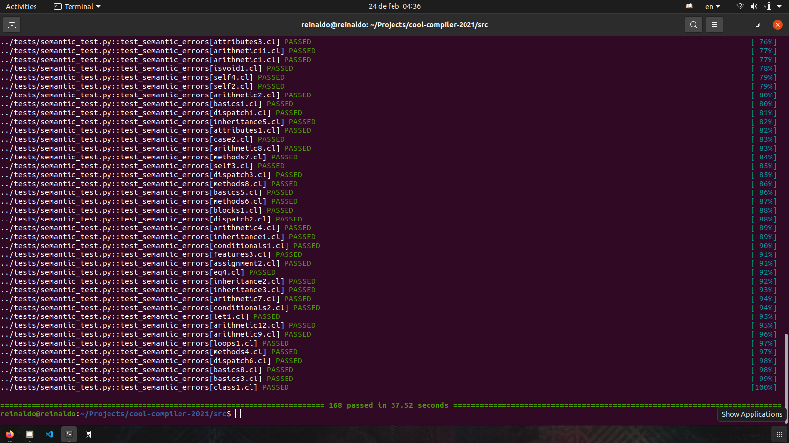

# COOL: Proyecto de Compilación

> Proyecto base para el compilador de 4to año en Ciencia de la Computación.

```bash
make test

pytest-3 ../tests -v --tb=short -m= -p no:warnings
============================================================================= test session starts ==============================================================================
platform linux -- Python 3.8.10, pytest-4.6.9, py-1.8.1, pluggy-0.13.0 -- /usr/bin/python3
cachedir: .pytest_cache
rootdir: /home/reinaldo/Projects/cool-compiler-2021
collected 168 items                                                                                                                                                            

../tests/codegen_test.py::test_codegen[atoi.cl] PASSED                                                                                                                   [  0%]
../tests/codegen_test.py::test_codegen[book_list.cl] PASSED                                                                                                              [  1%]
../tests/codegen_test.py::test_codegen[new_complex.cl] PASSED                                                                                                            [  1%]
../tests/codegen_test.py::test_codegen[arith.cl] PASSED                                                                                                                  [  2%]
../tests/codegen_test.py::test_codegen[io.cl] PASSED                                                                                                                     [  2%]
../tests/codegen_test.py::test_codegen[hairyscary.cl] PASSED                                                                                                             [  3%]
../tests/codegen_test.py::test_codegen[palindrome.cl] PASSED                                                                                                             [  4%]
../tests/codegen_test.py::test_codegen[print-cool.cl] PASSED                                                                                                             [  4%]
../tests/codegen_test.py::test_codegen[complex.cl] PASSED                                                                                                                [  5%]
../tests/codegen_test.py::test_codegen[list.cl] PASSED                                                                                                                   [  5%]
../tests/codegen_test.py::test_codegen[sort-list.cl] PASSED                                                                                                              [  6%]
../tests/codegen_test.py::test_codegen[primes.cl] PASSED                                                                                                                 [  7%]
../tests/codegen_test.py::test_codegen[graph.cl] PASSED                                                                                                                  [  7%]
../tests/codegen_test.py::test_codegen[life.cl] PASSED                                                                                                                   [  8%]
../tests/codegen_test.py::test_codegen[hello_world.cl] PASSED                                                                                                            [  8%]
../tests/codegen_test.py::test_codegen[cells.cl] PASSED                                                                                                                  [  9%]
../tests/codegen_test.py::test_codegen[fib.cl] PASSED                                                                                                                    [ 10%]
../tests/lexer_test.py::test_lexer_errors[string2.cl] PASSED                                                                                                             [ 10%]
../tests/lexer_test.py::test_lexer_errors[iis1.cl] PASSED                                                                                                                [ 11%]
../tests/lexer_test.py::test_lexer_errors[iis2.cl] PASSED                                                                                                                [ 11%]
../tests/lexer_test.py::test_lexer_errors[comment1.cl] PASSED                                                                                                            [ 12%]
../tests/lexer_test.py::test_lexer_errors[string4.cl] PASSED                                                                                                             [ 13%]
../tests/lexer_test.py::test_lexer_errors[iis6.cl] PASSED                                                                                                                [ 13%]
../tests/lexer_test.py::test_lexer_errors[iis4.cl] PASSED                                                                                                                [ 14%]
../tests/lexer_test.py::test_lexer_errors[string1.cl] PASSED                                                                                                             [ 14%]
../tests/lexer_test.py::test_lexer_errors[iis3.cl] PASSED                                                                                                                [ 15%]
../tests/lexer_test.py::test_lexer_errors[iis5.cl] PASSED                                                                                                                [ 16%]
../tests/lexer_test.py::test_lexer_errors[string3.cl] PASSED                                                                                                             [ 16%]
../tests/lexer_test.py::test_lexer_errors[mixed2.cl] PASSED                                                                                                              [ 17%]
../tests/lexer_test.py::test_lexer_errors[mixed1.cl] PASSED                                                                                                              [ 17%]
../tests/parser_test.py::test_parser_errors[loop1.cl] PASSED                                                                                                             [ 18%]
../tests/parser_test.py::test_parser_errors[let2.cl] PASSED                                                                                                              [ 19%]
../tests/parser_test.py::test_parser_errors[dispatch4.cl] PASSED                                                                                                         [ 19%]
../tests/parser_test.py::test_parser_errors[conditional6.cl] PASSED                                                                                                      [ 20%]
../tests/parser_test.py::test_parser_errors[class2.cl] PASSED                                                                                                            [ 20%]
../tests/parser_test.py::test_parser_errors[program3.cl] PASSED                                                                                                          [ 21%]
../tests/parser_test.py::test_parser_errors[method1.cl] PASSED                                                                                                           [ 22%]
../tests/parser_test.py::test_parser_errors[case1.cl] PASSED                                                                                                             [ 22%]
../tests/parser_test.py::test_parser_errors[assignment1.cl] PASSED                                                                                                       [ 23%]
../tests/parser_test.py::test_parser_errors[block3.cl] PASSED                                                                                                            [ 23%]
../tests/parser_test.py::test_parser_errors[method3.cl] PASSED                                                                                                           [ 24%]
../tests/parser_test.py::test_parser_errors[mixed6.cl] PASSED                                                                                                            [ 25%]
../tests/parser_test.py::test_parser_errors[dispatch5.cl] PASSED                                                                                                         [ 25%]
../tests/parser_test.py::test_parser_errors[case3.cl] PASSED                                                                                                             [ 26%]
../tests/parser_test.py::test_parser_errors[assignment3.cl] PASSED                                                                                                       [ 26%]
../tests/parser_test.py::test_parser_errors[dispatch9.cl] PASSED                                                                                                         [ 27%]
../tests/parser_test.py::test_parser_errors[method5.cl] PASSED                                                                                                           [ 27%]
../tests/parser_test.py::test_parser_errors[let3.cl] PASSED                                                                                                              [ 28%]
../tests/parser_test.py::test_parser_errors[dispatch8.cl] PASSED                                                                                                         [ 29%]
../tests/parser_test.py::test_parser_errors[method6.cl] PASSED                                                                                                           [ 29%]
../tests/parser_test.py::test_parser_errors[class5.cl] PASSED                                                                                                            [ 30%]
../tests/parser_test.py::test_parser_errors[let4.cl] PASSED                                                                                                              [ 30%]
../tests/parser_test.py::test_parser_errors[method4.cl] PASSED                                                                                                           [ 31%]
../tests/parser_test.py::test_parser_errors[case4.cl] PASSED                                                                                                             [ 32%]
../tests/parser_test.py::test_parser_errors[mixed3.cl] PASSED                                                                                                            [ 32%]
../tests/parser_test.py::test_parser_errors[loop4.cl] PASSED                                                                                                             [ 33%]
../tests/parser_test.py::test_parser_errors[method2.cl] PASSED                                                                                                           [ 33%]
../tests/parser_test.py::test_parser_errors[dispatch1.cl] PASSED                                                                                                         [ 34%]
../tests/parser_test.py::test_parser_errors[conditional5.cl] PASSED                                                                                                      [ 35%]
../tests/parser_test.py::test_parser_errors[dispatch7.cl] PASSED                                                                                                         [ 35%]
../tests/parser_test.py::test_parser_errors[class6.cl] PASSED                                                                                                            [ 36%]
../tests/parser_test.py::test_parser_errors[block4.cl] PASSED                                                                                                            [ 36%]
../tests/parser_test.py::test_parser_errors[case2.cl] PASSED                                                                                                             [ 37%]
../tests/parser_test.py::test_parser_errors[mixed4.cl] PASSED                                                                                                            [ 38%]
../tests/parser_test.py::test_parser_errors[case6.cl] PASSED                                                                                                             [ 38%]
../tests/parser_test.py::test_parser_errors[conditional1.cl] PASSED                                                                                                      [ 39%]
../tests/parser_test.py::test_parser_errors[operation1.cl] PASSED                                                                                                        [ 39%]
../tests/parser_test.py::test_parser_errors[let7.cl] PASSED                                                                                                              [ 40%]
../tests/parser_test.py::test_parser_errors[let5.cl] PASSED                                                                                                              [ 41%]
../tests/parser_test.py::test_parser_errors[dispatch3.cl] PASSED                                                                                                         [ 41%]
../tests/parser_test.py::test_parser_errors[program2.cl] PASSED                                                                                                          [ 42%]
../tests/parser_test.py::test_parser_errors[attribute1.cl] PASSED                                                                                                        [ 42%]
../tests/parser_test.py::test_parser_errors[operation4.cl] PASSED                                                                                                        [ 43%]
../tests/parser_test.py::test_parser_errors[class3.cl] PASSED                                                                                                            [ 44%]
../tests/parser_test.py::test_parser_errors[operation3.cl] PASSED                                                                                                        [ 44%]
../tests/parser_test.py::test_parser_errors[conditional4.cl] PASSED                                                                                                      [ 45%]
../tests/parser_test.py::test_parser_errors[class4.cl] PASSED                                                                                                            [ 45%]
../tests/parser_test.py::test_parser_errors[block1.cl] PASSED                                                                                                            [ 46%]
../tests/parser_test.py::test_parser_errors[dispatch2.cl] PASSED                                                                                                         [ 47%]
../tests/parser_test.py::test_parser_errors[conditional2.cl] PASSED                                                                                                      [ 47%]
../tests/parser_test.py::test_parser_errors[attribute3.cl] PASSED                                                                                                        [ 48%]
../tests/parser_test.py::test_parser_errors[loop3.cl] PASSED                                                                                                             [ 48%]
../tests/parser_test.py::test_parser_errors[block2.cl] PASSED                                                                                                            [ 49%]
../tests/parser_test.py::test_parser_errors[assignment2.cl] PASSED                                                                                                       [ 50%]
../tests/parser_test.py::test_parser_errors[conditional3.cl] PASSED                                                                                                      [ 50%]
../tests/parser_test.py::test_parser_errors[mixed5.cl] PASSED                                                                                                            [ 51%]
../tests/parser_test.py::test_parser_errors[mixed2.cl] PASSED                                                                                                            [ 51%]
../tests/parser_test.py::test_parser_errors[attribute2.cl] PASSED                                                                                                        [ 52%]
../tests/parser_test.py::test_parser_errors[let1.cl] PASSED                                                                                                              [ 52%]
../tests/parser_test.py::test_parser_errors[case5.cl] PASSED                                                                                                             [ 53%]
../tests/parser_test.py::test_parser_errors[operation2.cl] PASSED                                                                                                        [ 54%]
../tests/parser_test.py::test_parser_errors[let6.cl] PASSED                                                                                                              [ 54%]
../tests/parser_test.py::test_parser_errors[dispatch6.cl] PASSED                                                                                                         [ 55%]
../tests/parser_test.py::test_parser_errors[mixed1.cl] PASSED                                                                                                            [ 55%]
../tests/parser_test.py::test_parser_errors[program1.cl] PASSED                                                                                                          [ 56%]
../tests/parser_test.py::test_parser_errors[loop2.cl] PASSED                                                                                                             [ 57%]
../tests/parser_test.py::test_parser_errors[class1.cl] PASSED                                                                                                            [ 57%]
../tests/semantic_test.py::test_semantic_errors[basics2.cl] PASSED                                                                                                       [ 58%]
../tests/semantic_test.py::test_semantic_errors[arithmetic5.cl] PASSED                                                                                                   [ 58%]
../tests/semantic_test.py::test_semantic_errors[features1.cl] PASSED                                                                                                     [ 59%]
../tests/semantic_test.py::test_semantic_errors[let2.cl] PASSED                                                                                                          [ 60%]
../tests/semantic_test.py::test_semantic_errors[basics7.cl] PASSED                                                                                                       [ 60%]
../tests/semantic_test.py::test_semantic_errors[features2.cl] PASSED                                                                                                     [ 61%]
../tests/semantic_test.py::test_semantic_errors[inheritance4.cl] PASSED                                                                                                  [ 61%]
../tests/semantic_test.py::test_semantic_errors[basics4.cl] PASSED                                                                                                       [ 62%]
../tests/semantic_test.py::test_semantic_errors[dispatch4.cl] PASSED                                                                                                     [ 63%]
../tests/semantic_test.py::test_semantic_errors[methods3.cl] PASSED                                                                                                      [ 63%]
../tests/semantic_test.py::test_semantic_errors[arithmetic3.cl] PASSED                                                                                                   [ 64%]
../tests/semantic_test.py::test_semantic_errors[loops2.cl] PASSED                                                                                                        [ 64%]
../tests/semantic_test.py::test_semantic_errors[new1.cl] PASSED                                                                                                          [ 65%]
../tests/semantic_test.py::test_semantic_errors[case1.cl] PASSED                                                                                                         [ 66%]
../tests/semantic_test.py::test_semantic_errors[assignment1.cl] PASSED                                                                                                   [ 66%]
../tests/semantic_test.py::test_semantic_errors[eq3.cl] PASSED                                                                                                           [ 67%]
../tests/semantic_test.py::test_semantic_errors[dispatch5.cl] PASSED                                                                                                     [ 67%]
../tests/semantic_test.py::test_semantic_errors[basics6.cl] PASSED                                                                                                       [ 68%]
../tests/semantic_test.py::test_semantic_errors[case3.cl] PASSED                                                                                                         [ 69%]
../tests/semantic_test.py::test_semantic_errors[attributes2.cl] PASSED                                                                                                   [ 69%]
../tests/semantic_test.py::test_semantic_errors[assignment3.cl] PASSED                                                                                                   [ 70%]
../tests/semantic_test.py::test_semantic_errors[attributes4.cl] PASSED                                                                                                   [ 70%]
../tests/semantic_test.py::test_semantic_errors[methods2.cl] PASSED                                                                                                      [ 71%]
../tests/semantic_test.py::test_semantic_errors[self1.cl] PASSED                                                                                                         [ 72%]
../tests/semantic_test.py::test_semantic_errors[let3.cl] PASSED                                                                                                          [ 72%]
../tests/semantic_test.py::test_semantic_errors[arithmetic6.cl] PASSED                                                                                                   [ 73%]
../tests/semantic_test.py::test_semantic_errors[arithmetic10.cl] PASSED                                                                                                  [ 73%]
../tests/semantic_test.py::test_semantic_errors[eq1.cl] PASSED                                                                                                           [ 74%]
../tests/semantic_test.py::test_semantic_errors[methods1.cl] PASSED                                                                                                      [ 75%]
../tests/semantic_test.py::test_semantic_errors[methods5.cl] PASSED                                                                                                      [ 75%]
../tests/semantic_test.py::test_semantic_errors[eq2.cl] PASSED                                                                                                           [ 76%]
../tests/semantic_test.py::test_semantic_errors[attributes3.cl] PASSED                                                                                                   [ 76%]
../tests/semantic_test.py::test_semantic_errors[arithmetic11.cl] PASSED                                                                                                  [ 77%]
../tests/semantic_test.py::test_semantic_errors[arithmetic1.cl] PASSED                                                                                                   [ 77%]
../tests/semantic_test.py::test_semantic_errors[isvoid1.cl] PASSED                                                                                                       [ 78%]
../tests/semantic_test.py::test_semantic_errors[self4.cl] PASSED                                                                                                         [ 79%]
../tests/semantic_test.py::test_semantic_errors[self2.cl] PASSED                                                                                                         [ 79%]
../tests/semantic_test.py::test_semantic_errors[arithmetic2.cl] PASSED                                                                                                   [ 80%]
../tests/semantic_test.py::test_semantic_errors[basics1.cl] PASSED                                                                                                       [ 80%]
../tests/semantic_test.py::test_semantic_errors[dispatch1.cl] PASSED                                                                                                     [ 81%]
../tests/semantic_test.py::test_semantic_errors[inheritance5.cl] PASSED                                                                                                  [ 82%]
../tests/semantic_test.py::test_semantic_errors[attributes1.cl] PASSED                                                                                                   [ 82%]
../tests/semantic_test.py::test_semantic_errors[case2.cl] PASSED                                                                                                         [ 83%]
../tests/semantic_test.py::test_semantic_errors[arithmetic8.cl] PASSED                                                                                                   [ 83%]
../tests/semantic_test.py::test_semantic_errors[methods7.cl] PASSED                                                                                                      [ 84%]
../tests/semantic_test.py::test_semantic_errors[self3.cl] PASSED                                                                                                         [ 85%]
../tests/semantic_test.py::test_semantic_errors[dispatch3.cl] PASSED                                                                                                     [ 85%]
../tests/semantic_test.py::test_semantic_errors[methods8.cl] PASSED                                                                                                      [ 86%]
../tests/semantic_test.py::test_semantic_errors[basics5.cl] PASSED                                                                                                       [ 86%]
../tests/semantic_test.py::test_semantic_errors[methods6.cl] PASSED                                                                                                      [ 87%]
../tests/semantic_test.py::test_semantic_errors[blocks1.cl] PASSED                                                                                                       [ 88%]
../tests/semantic_test.py::test_semantic_errors[dispatch2.cl] PASSED                                                                                                     [ 88%]
../tests/semantic_test.py::test_semantic_errors[arithmetic4.cl] PASSED                                                                                                   [ 89%]
../tests/semantic_test.py::test_semantic_errors[inheritance1.cl] PASSED                                                                                                  [ 89%]
../tests/semantic_test.py::test_semantic_errors[conditionals1.cl] PASSED                                                                                                 [ 90%]
../tests/semantic_test.py::test_semantic_errors[features3.cl] PASSED                                                                                                     [ 91%]
../tests/semantic_test.py::test_semantic_errors[assignment2.cl] PASSED                                                                                                   [ 91%]
../tests/semantic_test.py::test_semantic_errors[eq4.cl] PASSED                                                                                                           [ 92%]
../tests/semantic_test.py::test_semantic_errors[inheritance2.cl] PASSED                                                                                                  [ 92%]
../tests/semantic_test.py::test_semantic_errors[inheritance3.cl] PASSED                                                                                                  [ 93%]
../tests/semantic_test.py::test_semantic_errors[arithmetic7.cl] PASSED                                                                                                   [ 94%]
../tests/semantic_test.py::test_semantic_errors[conditionals2.cl] PASSED                                                                                                 [ 94%]
../tests/semantic_test.py::test_semantic_errors[let1.cl] PASSED                                                                                                          [ 95%]
../tests/semantic_test.py::test_semantic_errors[arithmetic12.cl] PASSED                                                                                                  [ 95%]
../tests/semantic_test.py::test_semantic_errors[arithmetic9.cl] PASSED                                                                                                   [ 96%]
../tests/semantic_test.py::test_semantic_errors[loops1.cl] PASSED                                                                                                        [ 97%]
../tests/semantic_test.py::test_semantic_errors[methods4.cl] PASSED                                                                                                      [ 97%]
../tests/semantic_test.py::test_semantic_errors[dispatch6.cl] PASSED                                                                                                     [ 98%]
../tests/semantic_test.py::test_semantic_errors[basics8.cl] PASSED                                                                                                       [ 98%]
../tests/semantic_test.py::test_semantic_errors[basics3.cl] PASSED                                                                                                       [ 99%]
../tests/semantic_test.py::test_semantic_errors[class1.cl] PASSED                                                                                                        [100%]

========================================================================= 168 passed in 34.23 seconds ==========================================================================

```



