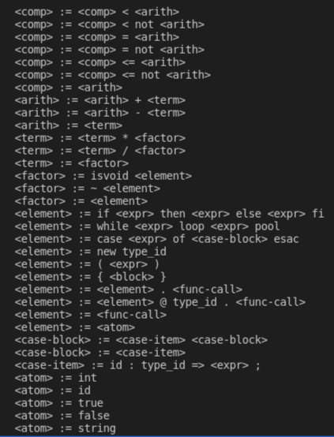
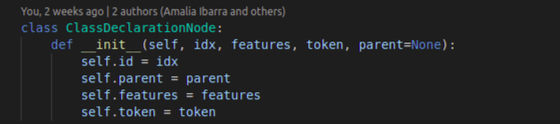

## Introducción

Cool(Classroom Object-Oriented Language) es un lenguaje de programación orientado a
objetos que, aunque pequeño, tiene muchas caracterı́sticas relevantes de lenguajes modernos. Su orientación a objetos, su tipado dinámico y el resto de sus features lo hacen muy atractivo e ideal para un primer acercamiento al mundo de los Compiladores. 

En el presente trabajo se muestra una implementación de un Compilador funcional para Cool en el lenguaje de programación python; los llamamos:  *El Compi*. 

En las próximas secciones se explican en detalle cada una de las fases en las que se divide el trabajo del mismo, como fue abordada cada una, las instrucciones para su uso y algunos otros detalles importantes a resaltar.


## Requerimientos e instrucciones para la ejecución

Para utilizar *El Compi* y ejecutar un programa en el lenguaje cool se han de seguir los siguientes pasos:

1- Primero se debe verificar que se cuente con todas las dependencias necesarias. Para una rápida instalación de estas se puede correr el comando:

```bash
$ pip install -r requirements.txt
```

2- Para compilador un código dado en Cool a ensamblador, ejecute:

```bash
$ ./coolc.sh <path_to_file/file_name.cl>
```
en una consola centrada en el directorio *src* que se encuentra en la raiz del proyecto. Aquí <file_name.cl> sería un archivo escrito en cool. 

3- El *output* esperado (en caso de no haberse detectado ningún error) es un archivo con el mismo nombre pero en .mips, el cual debe correrse con el correspondiente intérprete:

```bash
$ spim -file <path_to_file/file_name.mips>
```
que finalmente nos mostrará el resultado generado por el programa de entrada (spim se encuentra entre los requirements especificados).

Si se encuentran errores en el código de Cool proporcionado, el compilador los listará en consola, proporcionando detalles sobre su localización y tipo. Para más información sobre los errores de Cool manejados remitirse al README.md de la carpeta *src*.

## Arquitectura del compilador: 

*El Compi*, para tener la funcionalidad completa de un compilador, transita por las fases fundamentales de:

-Análisis sintáctico (Análisis léxico y parsing)

-Análisis semántico (Recolección, creación y chequeo de tipos)

-Generación de código (Traducción a un lenguaje intermedio y generación del correspondiente código mips)

Más adelante se analizan con más profundidad cada una.

El código fuente del proyecto se encuentra en la carpeta *src*. En esta se hallan distribuidos los scripts según su funcionalidad. 

**FOTO  de los archivos del proyecto**

Si lo miramos como módulos, podemos decir que el módulo de lexe... en *code_gen* encontramos todo lo referente al proceso de generación de código... en tools todo los utils para...

**COMPLETAR**

Analicemos ahora los prometidos detalles de implementacion y diseño tan anunciados. 

## Gramática
El primer paso para acercarnos al lenguaje objeto de análisis fue definir una gramática adecuada. Siguiendo lo referido por el manual de Cool (el cual se encuentra adjunto en la carpeta *doc*, con el resto de la documentación), se diseñó una gramática que respetara la precedencia necesaria de los operadores y la estructura requerida. En el archivo cool grammar.py puede observarse como fue modelada la misma. 

Como ahí se puede apreciar, un programa de Cool
consiste en una serie de definiciones de clases. Cada
clase a su vez posee un conjunto de atributos y de funciones. Las expresiones que pueden formar parte de
dichas funciones son el corazón del lenguaje.
En la imagen *1* se pueden apreciar varios niveles intermedios de esta gramática, lo cuales, precisamente, definen diferentes tipos de expresiones:

1. $<comp>$, que representa las operaciones de comparación entre elementos.

2. $<arith>$, que engloba a las operaciones de suma y
resta.

3. $<term>$, para la multiplicación y división.

4. $<factor>$, como representación de los operadores
unarios isvoid y opuesto.

5. $<element>$ para las condicionales (*if-then-else*, *while* y *case*), la instanciación con *new*, las expresiones entre paréntsis, los block, los dispatch.

6. $<atom>$ como el nivel más básico, donde se ex-
cuentran los números, ids, las expresiones boolea-
nas y los strings.



Figura 1: Fragmento de la gramática de Cool.


## Análisis sintáctico

### Tokenizer 
Para tokenizar la entrada se utilizó una herramienta bastante útil y práctica: PLY (https://www.dabeaz.com/ply/ply.html), la cual consiste en una implementación en python de las herramientas de parsing *Lex* y *Yacc*. Mediante el módulo lex que esta provee, es posible acceder a un analizador léxico ya implementado.

Para utilizarlo, se definieron una serie de reglas que orientaran al tokenizador como trabajar en las cadenas de entrada. En el archivo
token rules se pueden observar las reglas utilizadas, las cuáles consisten fundamentalmente en definiciones de los patrones que sigue cada token deseado, con la ayuda de expresiones regulares. En este sentido, se
trabajó fundamentalmente con el módulo re de python, el cual permite definir dichas expresiones.

Nótese que los *keywords* no requieren de una regla específica para su detección, listarlos es suficiente para que *lex* los tenga en cuenta en su análisis, pues son frases que se toman *as is*. Sin embargo, cabe destacar que para ser capaces de detectarlos independientemente del uso o no de mayúsculas y no confundirlos con types o identificadores, en las reglas de estos dos últimos se verifica la posibilidad de que la frase matcheada perteneza a la familia de palabras claves del lenguaje y se actúa acorde. 

Para la especificación de comentarios de más de una línea se arpvechó la facilidad de *lex* de definir estados alternativos al *INITIAL* o por defecto. Así fue posible asegurar que los símbolos de inicio - (* - y cierre -*)- estuvieran balanceados con reglas específicas al estado *Comments*.

Es importante destacar que los tokens de *lex* registran la posición que ocupan en el texto de entrada, considerando el mismo como una array de caracterres. Esto, con la ayuda de una regla para la detección de saltos de línea nos permite tener bien identificada la fila y la columna de un caracter en el script inicial, lo cual es sumamente importante en futuras fases del compilador para ubicar y reportar los errores detectados. 

### Parser

En cambio, para el parser, no fue la variante de ycc la que se decidió utilizar. En este caso, nos mantuvimos fieles a la implementación efectuada por el equipo en proyectos pasados, la cual se puede apreciar en el archivo *shift_reduce* parsers. Este cuenta con las modificaciones pertinentes para adaptarse a los nuevos requerimientos, por ejemplo, para la detección de fila y columna se realiza ahora el parseo sobre tokens del lenguaje, en lugar de sobre simples lexemas.

Con el uso del parser LR1 que aquí se provee y la gramática atributada de *cool_grammar.py*, es posible parsear un texto en cool y obtener un árbol correspondiente a una derivación de extrema derecha.

La construcción de este árbol o ast (*abstract syntax tree*) es la base del resto del análisis que se efectúa por el compilador. A lo largo de la ejecución del proyecto se utilizan variaciones de estos árboles, pero este primero que se menciona está formado por los nodos que se encuentran en el archivo *ast_nodes.py* y no es más que una representación bastante general de la jeraquía que sigue el programa parseado. 

Cada nodo posee los elementos que lo caracterizan, por ejemplo el *ClassDeclarationNode* cuenta con tokens como: el *id* que representa el nombre de la clase, un *parent* o tipo del que hereda (que puede ser *None* en caso de no existir), y la lista de *features*, o sea de definiciones de los métodos y atributos que posee. Además se añade un *token* que permita ubicar el inicio de la declaración en el código de entrada. 



## Chequeo semántico:

Una vez cosntruido el ast con la sintaxis adecuada, la fase siguiente consiste en verificar que el programa en cuestión esté correcto semánticamente.

Con este fin se realizan 3 recorridos sobre el árbol, apoyándonos en el patrón visitor propuesto:

-TypeCollector: Cuyo objetivo es registrar los tipos definidos por el programa. Aquí sólo se lanza un error cuando se intenta redefinir un tipo, o sea cuando aparece su definición más de una vez en el script de entrada.

-TypeBuilder: Recorrido que busca asignar los métodos y definiciones de atributos a sus clases correspondientes, y detectar errores relacionados con referencias a tipos inexistentes. En este caso es necesario notar que, como Cool permite la herencia, se debe asegurar en este recorrido que no existan ciclos entre las definiciones de clases. Además, para poder garantizar que no se redefinan métodos ni atributos, se asegura que en el momento de definición de un hijo ya se haya visitado al padre, de modo que se tenga constancia de los valores heredados para el análisis. En esta pasada se verifica también que se cumplan los requerimientos de la definición de una clase *Main* con su método *main* que no reciba parámetros, la cual funciona como punto de inicio de cualquier programa en Cool.

-TypeChecker: En este último recorrido sí se visitan la totalidad de nodos del ast creado, no sólo los correspondientes a definiciones de clases, métodos o atributos como en las pasadas anteriores. A medida que se recorre el árbol (con el contexto ya populado con las tipos correspondientes al programa y sus propiedades), se va chequeando que se haga un uso correcto de tipos a lo largo de las expresiones utilizadas, que no se referencien variables o atributos inexistentes o fuera de scope, etc, reportando siempre los errores encontrados.

Cada tipo con sus atributos y métodos se registra a partir de la clase *Context*. A su vez, para poder ubicar cada definición de variable en un contexto específico se utiliza la clase *Scope* que nos permite ir registrando scopes anidados. 

Si tras terminar estos recorridos no se encuentran errores es posible afirmar que el código .cl de entrada describe un programa correcto de Cool, o al menos hasta que un runtime error indique lo contrario ; ). Para poder obtener la salida esperada de este, es necesario entonces pasar a la última fase del proceso de compilación.
## Generación de código:

### Paso de Cool a CIL:

...
### De CIL de MIPS:
 ...