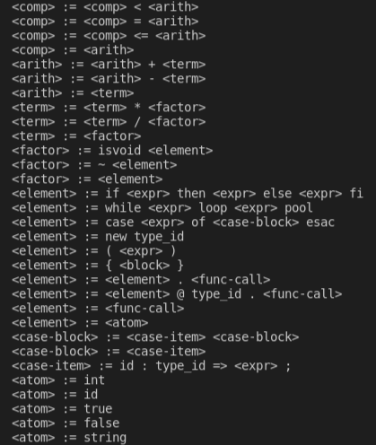

## Introducción

COOL(Classroom Object-Oriented Language) es un lenguaje de programación orientado a
objetos que, aunque pequeño, tiene muchas caracterı́sticas relevantes de lenguajes modernos. Su orientación a objetos, su tipado dinámico y el resto de sus features lo hacen muy atractivo e ideal para un primer acercamiento al mundo de los Compiladores.

En el presente trabajo se muestra una implementación de un Compilador funcional para COOL en el lenguaje de programación Python; lo llamamos: _El Compi_.

En las próximas secciones se explican en detalle cada una de las fases en las que se divide el trabajo del mismo, cómo fue abordada cada una, las instrucciones para su uso y algunos otros detalles importantes a resaltar.

## Requerimientos e instrucciones para la ejecución

Para utilizar _El Compi_ y ejecutar un programa en el lenguaje COOL se han de seguir los siguientes pasos:

1- Primero se debe verificar que se cuente con todas las dependencias necesarias. Para una rápida instalación de estas se puede correr el comando:

```bash
$ pip install -r requirements.txt
```

2- Para compilar un código dado en COOL a ensamblador, ejecute:

```bash
$ ./coolc.sh <path_to_file/file_name.cl>
```

en una consola centrada en el directorio _src_ que se encuentra en la raiz del proyecto. Aquí <file_name.cl> sería un archivo escrito en cool.

3- El _output_ esperado (en caso de no haberse detectado ningún error) es un archivo con el mismo nombre pero en .mips, el cual debe correrse con el correspondiente intérprete:

```bash
$ spim -file <path_to_file/file_name.mips>
```

que finalmente nos mostrará el resultado generado por el programa de entrada (spim se encuentra entre los requirements especificados).

Si se encuentran errores en el código de Cool proporcionado, el compilador los listará en consola, proporcionando detalles sobre su localización y tipo. Para más información sobre los errores de Cool manejados remitirse al README.md de la carpeta _src_.

## Arquitectura del compilador:

_El Compi_, para tener la funcionalidad completa de un compilador, transita por las fases fundamentales de:

-Análisis sintáctico (Análisis léxico y parsing)

-Análisis semántico (Recolección, creación y chequeo de tipos)

-Generación de código (Traducción a un lenguaje intermedio y generación del correspondiente código mips)

Más adelante se analizan a profundidad cada una.

El código fuente del proyecto se encuentra en la carpeta _src_. En esta se hallan distribuidos los scripts según su funcionalidad.

**FOTO de los archivos del proyecto**

Si lo miramos como módulos, podemos decir que el módulo de lexe... en _code_gen_ encontramos todo lo referente al proceso de generación de código... en tools todo los utils para...

**COMPLETAR**

Analicemos ahora los prometidos detalles de implementacion y diseño tan anunciados.

## Gramática

El primer paso para acercarnos al lenguaje objeto de análisis fue definir una gramática adecuada. Siguiendo lo referido por el manual de Cool (el cual se encuentra adjunto en la carpeta _doc_, con el resto de la documentación), se diseñó una gramática que respetara la precedencia necesaria de los operadores y la estructura requerida. En el archivo cool grammar.py puede observarse como fue modelada la misma.

Como ahí se puede apreciar, un programa de Cool
consiste en una serie de definiciones de clases. Cada
clase a su vez posee un conjunto de atributos y de funciones. Las expresiones que pueden formar parte de
dichas funciones son el corazón del lenguaje.
En la imagen _1_ se pueden apreciar varios niveles intermedios de esta gramática, lo cuales, precisamente, definen diferentes tipos de expresiones:

1.  **< comp >** , que representa las operaciones de comparación entre elementos.

2.  **< arith >** , que engloba a las operaciones de suma y
    resta.

3.  **< term >** , para la multiplicación y división.

4.  **< factor >** , como representación de los operadores
    unarios isvoid y opuesto.

5.  **< element >** para las condicionales (_if-then-else_, _while_ y _case_), la instanciación con _new_, las expresiones entre paréntsis, los block, los dispatch.

6.  **< atom >** como el nivel más básico, donde se ex-
    cuentran los números, ids, las expresiones boolea-
    nas y los strings.



## Análisis sintáctico

### Tokenizer

Para tokenizar la entrada se utilizó una herramienta bastante útil y práctica: [PLY](https://www.dabeaz.com/ply/ply.html), la cual consiste en una implementación en python de las herramientas de parsing _Lex_ y _Yacc_. Mediante el módulo lex que esta provee, es posible acceder a un analizador léxico ya implementado.

Para utilizarlo, se definieron una serie de reglas que orientaran al tokenizador como trabajar en las cadenas de entrada. En el archivo
token rules se pueden observar las reglas utilizadas, las cuáles consisten fundamentalmente en definiciones de los patrones que sigue cada token deseado, con la ayuda de expresiones regulares. En este sentido, se
trabajó fundamentalmente con el módulo re de python, el cual permite definir dichas expresiones.

Nótese que los _keywords_ no requieren de una regla específica para su detección, listarlos es suficiente para que _lex_ los tenga en cuenta en su análisis, pues son frases que se toman _as is_. Sin embargo, cabe destacar que para ser capaces de detectarlos independientemente del uso o no de mayúsculas y no confundirlos con types o identificadores, en las reglas de estos dos últimos se verifica la posibilidad de que la frase matcheada perteneza a la familia de palabras claves del lenguaje y se actúa acorde.

Para la especificación de comentarios de más de una línea se arpvechó la facilidad de _lex_ de definir estados alternativos al _INITIAL_ o por defecto. Así fue posible asegurar que los símbolos de inicio - (_ - y cierre -_)- estuvieran balanceados con reglas específicas al estado _Comments_.

Es importante destacar que los tokens de _lex_ registran la posición que ocupan en el texto de entrada, considerando el mismo como una array de caracterres. Esto, con la ayuda de una regla para la detección de saltos de línea nos permite tener bien identificada la fila y la columna de un caracter en el script inicial, lo cual es sumamente importante en futuras fases del compilador para ubicar y reportar los errores detectados.

### Parser

En cambio, para el parser, no fue la variante de ycc la que se decidió utilizar. En este caso, nos mantuvimos fieles a la implementación efectuada por el equipo en proyectos pasados, la cual se puede apreciar en el archivo _shift_reduce_ parsers. Este cuenta con las modificaciones pertinentes para adaptarse a los nuevos requerimientos, por ejemplo, para la detección de fila y columna se realiza ahora el parseo sobre tokens del lenguaje, en lugar de sobre simples lexemas.

Con el uso del parser LR1 que aquí se provee y la gramática atributada de _cool_grammar.py_, es posible parsear un texto en cool y obtener un árbol correspondiente a una derivación de extrema derecha.

La construcción de este árbol o ast (_abstract syntax tree_) es la base del resto del análisis que se efectúa por el compilador. A lo largo de la ejecución del proyecto se utilizan variaciones de estos árboles, pero este primero que se menciona está formado por los nodos que se encuentran en el archivo _ast_nodes.py_ y no es más que una representación bastante general de la jeraquía que sigue el programa parseado.

Cada nodo posee los elementos que lo caracterizan, por ejemplo el _ClassDeclarationNode_ cuenta con tokens como: el _id_ que representa el nombre de la clase, un _parent_ o tipo del que hereda (que puede ser _None_ en caso de no existir), y la lista de _features_, o sea de definiciones de los métodos y atributos que posee. Además se añade un _token_ que permita ubicar el inicio de la declaración en el código de entrada.


## Chequeo semántico:

Una vez cosntruido el ast con la sintaxis adecuada, la fase siguiente consiste en verificar que el programa en cuestión esté correcto semánticamente.

Con este fin se realizan 3 recorridos sobre el árbol, apoyándonos en el patrón visitor propuesto:

-TypeCollector: Cuyo objetivo es registrar los tipos definidos por el programa. Aquí sólo se lanza un error cuando se intenta redefinir un tipo, o sea cuando aparece su definición más de una vez en el script de entrada.

-TypeBuilder: Recorrido que busca asignar los métodos y definiciones de atributos a sus clases correspondientes, y detectar errores relacionados con referencias a tipos inexistentes. En este caso es necesario notar que, como Cool permite la herencia, se debe asegurar en este recorrido que no existan ciclos entre las definiciones de clases. Además, para poder garantizar que no se redefinan métodos ni atributos, se asegura que en el momento de definición de un hijo ya se haya visitado al padre, de modo que se tenga constancia de los valores heredados para el análisis. En esta pasada se verifica también que se cumplan los requerimientos de la definición de una clase _Main_ con su método _main_ que no reciba parámetros, la cual funciona como punto de inicio de cualquier programa en Cool.

-TypeChecker: En este último recorrido sí se visitan la totalidad de nodos del ast creado, no sólo los correspondientes a definiciones de clases, métodos o atributos como en las pasadas anteriores. A medida que se recorre el árbol (con el contexto ya populado con las tipos correspondientes al programa y sus propiedades), se va chequeando que se haga un uso correcto de tipos a lo largo de las expresiones utilizadas, que no se referencien variables o atributos inexistentes o fuera de scope, etc, reportando siempre los errores encontrados.

Cada tipo con sus atributos y métodos se registra a partir de la clase _Context_. A su vez, para poder ubicar cada definición de variable en un contexto específico se utiliza la clase _Scope_ que nos permite ir registrando scopes anidados.

Si tras terminar estos recorridos no se encuentran errores es posible afirmar que el código .cl de entrada describe un programa correcto de Cool, o al menos hasta que un runtime error indique lo contrario ;-). Para poder obtener la salida esperada de este, es necesario entonces pasar a la última fase del proceso de compilación.

## Generación de código:

El paso de Cool a Mips es demasiado complejo, por ello se divide el proceso de generación de código en dos fases:

### Paso de Cool a CIL:

Para la generación de código intermedio nos auxiliamos del lenguaje de máquina CIL, que cuenta con capacidades orientadas a objetos y nos va a permitir generar código MIPS de manera más sencilla.

El ast de CIL se obtiene a partir de un recorrido por el ast de Cool, para el cual nos apoyamos, una vez más, en el patrón visitor. El objetivo de este recorrido es desenrollar cada expresión para garantizar que su traducción a MIPS genere una cantidad constante de código.

CIL tiene 3 secciones:

- TYPES: contiene declaraciones de tipos.

- DATA: contiene todas las cadenas de texto constantes que serán usadas durante el programa.

- CODE: contiene todas las funciones que serán usadas durante el programa.

La primera sección que se contruye es la sección .TYPES con las declaraciones de los tipos que se van a usar en el programa.

En CIL no existe el concepto de herencia, la forma
de asegurar que un tipo pueda acceder a sus métodos y atributos heredados es declarándolos explícitamente en su definición. Además, es necesario garantizar que el orden en que se definen los mismos en el padre se conserve en los descendientes. Para ello a la hora de definir un tipo A se declaran en orden los atributos y métodos correspondientes comenzando por los de su ancestro más lejano hasta llegar a su padre y a los propios. Nótese que se hace necesario guardar el tipo al que pertenece el atributo o método originalmente, a continuación se explica por qué.

Dado un tipo A que hereda de B ¿Qué pasa con los atributos heredados cuando vamos a crear una instancia de A? ¿Cómo accedemos a la expresión con que se inicializa cada atributo si se declaró en otro tipo? Después de un breve análisis, salta a la luz que es necesario que los atributos tengan constructores. Entonces, inicializar un atributo heredado se traduce a asignarle el valor que devuelve el constructor del mismo :D. Para hacer el llamado a dicho constructor es necesario saber el tipo donde fue declarado el atributo originalmente, por eso se guarda en el proceso de construcción del tipo antes descrito. Lo mismo sucede con los métodos.

La sección .DATA se llena a medida que se visitan cadenas de texto literales, además se añaden algunas otras que nos serán útiles más adelante. Por ejemplo, se guardan los nombres de cada tipo declarado para poder acceder a ellos y devolverlos en la función **type_name**.

Expliquemos entonces de qué va la sección .CODE, que no por última es menos importante. De manera general, está conformada por las funciones de COOL que se traducen a CIL. En el cuerpo de estas funciones se encuentra la traducción de las expresiones de COOL. Este proceso se hace más complejo para ciertos tipos de expresiones, donde un poquito más de creatividad es a veces necesario. Analicemos una de estas.

Las expresiones **case** son de la siguiente forma:

```
case < expr0 > of
    < id1 > : < type1 > => < expr1 >;
    . . .
    < idn > : < typen > => < exprn >;
esac
```

Esta expresión se utiliza para hacer pruebas sobre el tipo de los objetos en tiempo de ejecución. Con ese fin, se evalúa **expr0** y se guarda su tipo dinámico **C**. Luego se selecciona la rama cuyo tipo **typek** es el más cercano a **C** entre los tipos con que **C** se conforma y se devuelve el valor del **exprk** correspondiente.

El tipo dinámico **C** no se conoce hasta el momento de ejecución, que es cuando se evalúa la expresión, por tanto, la decisión de por qué rama se debe decantar el **case** no se puede tomar desde CIL. La solución consiste entonces en indicarle a MIPS los pasos que debe tomar en esta situación. ¿Cómo se hace esto? Se genera el código CIL para cualquiera de los posibles tipos dinámicos de **expr0**, que no son más que todos los tipos que heredan del tipo estático de **expr0**.

### De CIL a MIPS:

...
