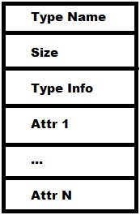

# Compilador de Cool

- José Carlos Hernández Piñera   C411
- Yan Carlos González Blanco       C411
- Henry Estévez Gómez                  C411


## Temario

1. Detalles técnicos
   - Dependencias del proycto.
   - Estructura y organización del proyecto.
   - Cómo ejecutarlo.
2. Documentación acerca del desarrollo y funcionamiento del proyecto
   - Análisis sintáctico
     - Lexer
     - Parser
   - Análisis semántico
   - Generación de código
     - Código intermedio (CIL)
     - Código MIPS
3. Principales problemas técnicos.


### 1. Detalles técnicos

​	Para el uso del compilador se hace necesarion tener instalado Python 3.7 o superior. De manera general se emplean pocos paquetes de terceros, de cualquier forma se muestran a continuación los detalles relacionados con estos y para que se usan dentro del compilador.

- ply: es una implementación enteramente en Pyhton de las herramientas de análisis _lex_ y _yacc_, que facilitan el desarrollo del lexer y el parser, brindando un cómodo y aceptado manejo de los mismos.
- pytest y pytest-ordering: se usan para llevar a cabo los tests automáticos de cada una de las fases por la que transita el compilador.


​	De igual manera dentro del archivo _requirements.txt_  se encuentran recogidas todas las dependencias del proyecto, además de que se ofrece la posibilidad de utilizar un entorno virutal por medio de _pipenv_ para garantizar que el ambiente en que se pruebe posteriormente el compilador sea exactamente el mismo en el que se desarrolló y por tanto evitar problemas de incongruencia de paquetes y módulos.

Si se quisiera instalar directamente los paquetes sin hacer uso de pipenv el comando sería:

```bash
pip3 install -r requirements.txt
```

Ahora usando pipenv tenemos:

```bash
~$ pipevn shell
~$ pipenv install --ignore-pipefile
```

Notemos que ambos comandos se ejecutan en una terminal ubicada en la raiz del proyecto.

​	El archivo principal del proyecto es _main.py_, se encuentra ubicado en la carpeta _src_, este recibe como argumento dos ficheros: uno de entrada que debe tener la extensión .cl (que cuenta con el código de COOL) y otro de salida donde se devuelve el código generado en MIPS. 

​	El compilador también se puede ejecutar haciendo uso del fichero _coolc.sh_, ubicado también dentro del directorio _src_. 

​	Una vez que se ejecute el compilador el fichero generado con el código de MIPS, se ubicará en la misma carpeta, con el nombre _mips_code.asm_, esto se realizará siempre que no se pase fichero de salida a la hora de llamar al _main_, puesto que este segundo parámentro no es obligatorio para nosotros.

​	Estructura y organización de los directorios del proyecto a partir de la carpeta _src_:

```bash
.
├── cool
│   ├── code.cl
│   ├── codegen
│   │   ├── cilgen.py
│   │   ├── cil_visitor.py
│   │   ├── codegen.py
│   │   ├── __init__.py
│   │   ├── __main__.py
│   │   ├── mipsgen.py
│   │   ├── mips_visitor.py
│   │   └── utils
│   │       ├── ast_cil.py
│   │       ├── __init__.py
│   │       ├── __main__.py
│   │       ├── print_ast.py
│   │       └── tools.py
│   ├── __init__.py
│   ├── lexer
│   │   ├── __init__.py
│   │   ├── lexer.py
│   │   └── __main__.py
│   ├── __main__.py
│   ├── parser
│   │   ├── __init__.py
│   │   ├── __main__.py
│   │   ├── output
│   │   │   ├── debug.txt
│   │   │   ├── parselog.txt
│   │   │   └── parsetab.py
│   │   └── parser.py
│   ├── semantic
│   │   ├── collectVariables.py
│   │   ├── helpers.py
│   │   ├── __init__.py
│   │   ├── __main__.py
│   │   ├── semantic.py
│   │   ├── typeBuilder.py
│   │   ├── typeChecker.py
│   │   ├── typeCollector.py
│   │   └── types.py
│   └── utils
│       ├── ast.py
│       ├── errors.py
│       ├── helpers.py
│       ├── __init__.py
│       ├── logger.py
│       ├── __main__.py
│       ├── tokens.py
│       └── visitor.py
├── coolc.sh
├── main.py
├── makefile
├── mips-code.asm
├── Readme.md
```


### 2. Documentación acerca del desarrollo y funcionamiento del proyecto

Esta sección se encuentra dividida en 3 grupos o fases:

- Análisis sintáctico: comprende desde la comprobación del código fuente escrito en _COOL_ hasta su representación en el árbol de derivación, incluye todos los aspectos relacionados con la definición de la gramática, así como la construcción del lexer y el parser. 
- Análisis semántico: se basa en la revisión de los aspectos aceptados en la fase anterior, mediante la validación de que todos los predicados semánticos definidos previamente se cumplan.
- Generación de código: luego de cada uno de los chequeos aplicados en las fases anteriores, se construye un código intermedio para la posterior transformación a código _MIPS_.

Se intentará detallar lo mejor posible cada una de estas fases a lo largo del informe.

#### Análisis sintáctico:

​	Como se mencionó en la sección anterior para el desarrollo del compilador se uso _ply_, paquete que incluye soporte al parser _LALR(1)_, así como las herramientas para el análisis léxico de validación de entrada y el reporte de errores.

​	El análisis sintáctico se encuentra separado en dos fases:  en una se realiza el análisis léxico y en la otra el proceso de parsing.

**Análisis léxico:**

​	Esta fase en encarga del procesamiento del código fuente escrito en _Cool_, mediante la creación de _tokens_, que no son más que secuencias de caracteres que tienen un significado para el programa. Todos los espacios en blanco, campos de línea (\n), tabuladores (\t) y demás caracteres sin importancia son removidos también durante esta fase.

​	Dicho de otra forma, el lexer no es otra cosa que el proceso de transformación de de una secuencia de caracteres (strings) en una secuencia de tokens.

​	Un token está representado por la siguiente clase:

```python
class Token:
    def __init__(self, lex: str, type_: str, lineno: int, pos: int):
        self.lex = lex
        self.type = type_
        self.lineno = lineno
        self.pos = pos

    def __str__(self):
        return f'{self.type}: {self.lex} ({self.lineno}, {self.pos})'

    def __repr__(self):
        return str(self)
```

​	Como se puede comprbar un token está compuesto por un lexema, que no es más que una especie de nombre que se le hace corresponder al token; además también cuenta con un tipo, que se emplea para agrupar a los que tienen características similares, notar que para las palabras reservadas del lenguaje el lexema y el tipo son el mismo, no ocurriendo lo mismo para los strings y números. También se lleva para cada token el número de línea en el que aparece y la posición dentro de esa línea (número de la columna).

​	La definición de todas las palabras reservadas del lenguaje se encuentra recogida dentro de _tokens.py_ ubicado en el directorio _src/cool/utils_. 

​	El proceso de selección de los tokens dentro de código fuente se realiza por medio de una serie de expresiones regulares, definidas para cada una de las palabras reservadas del lenguaje, así como para todos los símbolos presentes en Cool.

​	Para ello se emplea _ply_, quien propone una especie de convención de la forma t_tipo y la definición de la expresión regular dentro del docstring del método.

​	En resumen sería algo como lo que se presenta a continuación:

```python
def t_equal(self, t):
    r'='
    self.update_column(t)
    return t
```

**Proceso de Parsing**

​	El parser, que no es más que el análisis de la secuencia de tokens que se obtienen en la sección anterior y la producción del árbol de derivación, también se implementó mediante _ply_. 

​	_Ply_ brinda igualmente una conveción para la correcta definición de las funciones relacionadas con el proceso; para cada regla gramatical hay una función cuyo nombre empieza con p_ y en el docstring contiene la forma de la producción.

​	Sería algo como lo que se presenta a continuación.

```python
def p_atom_new(self, p):
   'atom : new type'
    p[0] = InstantiateNode(p.slice[2])
```

​	_Ply_ usa los (:) para separar la parte izquierda de la parte derecha de la producción, y en cuerpo de la función contiene el código que realiza la acción de esa producción. En cada producción se construye un nodo del Árbol de Sintaxis Abstracta (AST). 

​	El parámetro _p_  que se muestra dentro del cuerpo contiene los resultados que se obtuvieron luego de parsear el lado derecho de la producción. Es posible indexar en p para acceder a los datos, en el índice 0 se deja siempre el resultado de la acción que se realizó, mientras que a partir de 1 nos comenzamos a referirnos al primer símbolo de la parte derecha de la producción.

​	_Ply_ genera un parser que usa el algoritmo de shift-reduce LALR(1), uno de los más usados en la actualidad, notemos que la gramática de Cool fue refactorizada para ser procesada por LALR(1) sin errores (para ello se eliminó todo tipo de ambigüedad y se tuvo en cuenta la precedencia de todos los operadores presentes), puesto que LALR(1) no puede manejar todas las gramáticas libres del contexto. 

​	_Ply_ también se emplea para la recuperación y el manejo de los errores.


#### Análisis semántico

​	El objetivo del análisis semántico es validar el correcto cumplimiento de los predicados semánticos y validar, además, la información de los tipos para la posterior fase de transformación del código de Cool a Mips.

​	Para el desarrollo de esta fase nos apoyamos en el árbol de derivación, estructura que se presenta de forma conveniente para ser explorada, luego el procedimiento para validar cada uno de los predicados pasa por realizar un recorrido por cada uno de los nodos de dicho árbol.

​	Dado el hecho de que la mayoría de las reglas semánticas incluyen al uso de variables y funciones, así como las definiciones de estas; se hace necesario, por lo tanto, acceder a un scope, donde están definidas todas las variables y funciones que se emplean en el nodo.

​	También se emplea un Contexto, que contiene todas las definiciones de los tipos que se construyen a lo largo del programa.

​	Para realizar estos recorridos de los que se hablan se emplea el patrón _visitor_, el cual será de relevante importancia a partir de este momento y se usará como pieza fundamental en todas las acciones que se realicen para el funcionamiento del compilador, este patrón nos permite realizar una abstracción en el concepto de procesamiento de un nodo.

​	Apoyándonos en _visitor_, en esta fase realizamos varios recorridos sobre el AST, que permiten en este orden, realizar los siguientes procedimientos:

- Recolectar los tipos definidos, la implementación está dentro de _TypeCollector_, en este recorrido solo nos interesan los nodos _ProgramNode_ y _ClassDeclarationNode_.

- Construcción del contexto de métodos y atributos, la implementaión está dentro de _TypeBuilder_, en este recorridos solo nos interesan los nodos _FuncDeclarationNode_ y _AttrDeclarationNode_

- Construcción de scopes recolectando las variables definidas en el programa; teniendo en cuenta, como es natural, la visibilidad de cada una de estas, la implementación está dentro de _CollectVariables_.

  ​	En este punto se requiere un poco de atención sobre el orden en que se definen los atributos, puesto que la inicialización de estos no puede depender de uno que esté declarado posteriormente en el código.

- Chequear los tipos, en esta pasada se verifica la consistencia de todos los tipos presentes en todos los nodos del AST para detectar con ello la mayor cantidad de errores y por consiguiente la creación de instancias de ErrorType para mostrar que cierto tipo presentó algún error semántico. La implentación está dentro de _TypeCheker_.

​	Toda la implementación referente al procesamiento de esta etapa del compilador está en el directorio _src/cool/semantic_. Se pueden referir a la misma para analizar cualquier duda que surja.


#### Generación de código.

​	Para la etapa de generación de código, debido a que el salto de Cool a Mips, es demasiado complejo, se genera primeramente un código intermedio, CIL, para facilitar todo el proceso.

**Código intermedio (Cool -> Cil)**

​	Para la generación de Cil, también se emplea el patrón visitor, la idea principal es generar para cada nodo del AST de Cool, su correspondiente conjunto de instrucciones el Cil; en todo momento se asegura que las variables y funciones dentro del programa tengan nombre únicos para asegurar que no ocurran futuras incongruencias o inconsistencias durante la generación y posterior ejecución.

​	En el leguanje intermendio se menejan 3 secciones fundamentales .TYPES, .DATA y .CODE, que recojen todos los tipos declarados en el programa con sus correspondientes funciones y atributos, las cadenas de texto constantes que serán usadas durante la ejecución y el cuerpo de la funciones en sí, respectivamente.

​	Los tipos built-in que existen en Cool (Object, IO, Int, String, Bool) son definidos directamente dentro de CIL, para garantizar un fácil manejo de todas las funciones presentes en estos métodos, se concretó la idea de crear nuevo nodos en Cil: _ExitNode_ y _CopyNode_ para _abort_ y _copy_ de Object; además por el hecho de que en Mips se realiza un trato diferente asociados a los tipos _int_ y _string_ cuando se hacen llamados al sistema se decidió eliminar las funciones Read y Print, para en su lugar agregar: ReadInt, ReadString, PrintInt, PrintString, esto persigue que se realice de forma más natural y simple los llamados a: in_int, in_string, out_int y out_string presentes en IO.

​	Por otro lado para los métodos de String: lenght, concat y substr se crearon los nodos: LenghtNode, ConcatNode y SubstringNode, para garantizar lo mismo que se persigue en la explicación del párrafo anterior.

​	Con esto dichas funciones se crear directamente en la generación a Mips; lo que permite, como es fácil notar, ganar en eficiencia y manejar de forma más adecuada las particularidades de cada una de ellas.

​	Algo que presentó una notable relevancia en la generación de Cil fue el hecho de la inicialización de los atributos, nos referimos tanto a los heredados como los de la propia clase; cuando se crea una instancia  de una clase se deben inicializar todos los atributos a su expresión inicial, en caso de que tengan alguna, en  otro caso se usa su expresión por defecto; esto se aseguró creando para cada tipo un constructor que se encarga de darle un valor a cada uno de sus atributos, este es llamada cada vez que se crea la instancia de algún tipo.  

**Generación de MIPS (Cil -> Mips)**

​	Naturalmente para generar el código en Mips también se emplea el patrón visitor, pero en esta ocasión recorriendo todos los nodos de Cil que fueron creados en el paso anterior, para cada uno de estos nodos de Cil, se genera el conjunto de instrucciones necesarias para Mips.

​	Una de las principales dificultades que se presentaron en esta sección fue la representación de los objetos en memoria, para ello se necesita guardar la información referente al tipo del objeto, los métodos y sus atributos, además de información extra y de otros aspectos útiles referentes al tipo (por ejemplo una referencia al tipo del padre).



​	La imagen anterior muestra la forma en la que se representan los objetos en memoria. El TypeInfo almacena una referencia al nombre del tipo, la información del tipo del padre y además una tabla donde están ubicados los métodos del objeto como tal, y en la misma forma en la que se guardan en Cil. 

​	A la hora de crear un objeto, se calcula el tamaño que ocupará, que no es otra cosa que el total de atributos más los 3 campos adicionales usados para guardar la otra información. 

​	El orden en el que se ubican los atributos, es primero los del padre y luego los propios del objeto, entonces a la hora de acceder a ellos se calcula el offset de este atributo en su tipo estático y a este se le suma 3 porque ahí es donde empiezan a presentar los mismo. 

​	De forma similar se hace para acceder a los métodos, primero se busca en la posición 3 de la tabla del objeto, donde encontramos el TypeInfo y desde allí se accede a la nueva tabla a partir de la cuál se busca el índice de la función llamada según la información que se tiene del tipo estático del objeto, resaltar que ahí se encuentra la dirección real del método.


#### Problemas técnicos

​	Un especial tratamiento hubo que dedicarle al menejo de los comentarios y strings en el lexer, puesto que las expresiones regulares que se definieron para el manejo de estos no cubrían todos los casos posibles. Para ello _ply_ ofrecía una solución que consitía en crear una especie de estados, donde una vez que se accede a esos estados, se le puede dar un tratamiento diferenciado a ciertos tokens, tratamiento que no poseen en el estado _Initial_, que es el que se usa por defecto en _ply_. En este punto lo más difícil de anlizar fueron los comentarios que se realizaban con ((\*...\*)), pero para ello al encontrarse el primer (* se entró a un nuevo estado y por tanto todas las demás reglas eran ignoradas, en ese estado nos mantuvimos hasta llegar a *).

​	Los otros problemas más relevantes que tuvimos radicaron en la generación de código, por ejemplo a la hora de determinar como utilizar los registros para almacenar los valores y con que fin se iba a utilizar cada uno; también surgieron otros errores, pero afortunadamente se le puedo dar con la solución aceptada para cada uno de ellos.