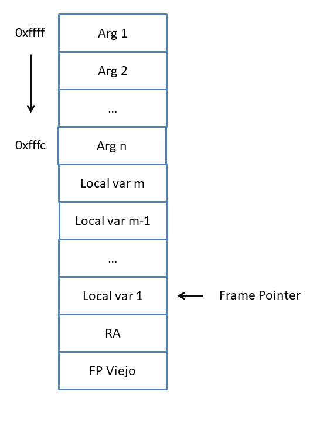

# Informe

El objetivo principal de la aplicación es contruir un compilador que convierta un programa de COOL en un programa funcionalmente equivalente en MIPS. Se mostrará su uso y se describirá la arquitectura y procesos relacionados con su contrucción y funcionamiento.

## ¿Cómo Instalarlo?

### Clonar el repositorio
  
``` bash
git clone https://github.com/WataLuisoDalmauCompiler/cool-compiler-2021.git
cd cool-compiler-2021  
```

### Instalar requerimientos

``` bash
pip install -r requirements.txt
```

## ¿Cómo usar el compilador?

### Uso básico

Para el uso del compilador es necesario correr el archivo `src/coolc.sh`. Este compilará el programa COOL que se le dió como entrada y guardará el programa MIPS en la misma localización con extensión _.mips_.

``` bash
 ./src/coolc.sh <archivo_programa_cool>
```

### Uso avanzado

El compilador hecho presenta otras funcionalidades a las cuales se puede acceder si se llama al programa
`src/cool_cmp/main.py`  mediante diferentes flags que se le pasan como argumentos:

- `-m`: Guarda el programa compilado a MIPS en el archivo de salida dado con extensión `.mips`
- `-c`: Guarda el programa generado de CIL en el archivo de salida dado con extensión `.cil`
- `-i`: Guarda el progama de COOL con los AutoType resueltos en el archivo de salida dado con extensión `.infer.cil`
- `-icil`: Interpreta el AST de CIL generado por el programa de entrada
- `-icool`: Interpreta el AST de Cool generado por el programa de entrada

Por ejemplo el siguiente programa interpreta y guarda el código CIL generado
> $python3 src/cool_cmp/main.py src/testing.cl src/testing.cil -icil -c

También posee otras funcionalidades previstas para el desarrollador del compilador:

- `-ucp`: Actualiza el parser serializado de Cool
- `-ucl`: Actualiza el lexer serializado de Cool

### Uso para el desarrollador

Para probar un programa específico de COOL, se dejó una configuración por defecto para debuguear en el Visual Studio Code. Esta tiene como entrada el archivo testing.cl.

Para probar el código generado por el compilador debe escribir la entrada en el archivo input.txt, la salida esperada en el archivo expected\_output.txt y ejecutar el siguiente comando:

``` bash
./src/test_mips.sh
```

## Arquitectura

### Estructura

El compilador se divide en varios módulos entre los más destacados están:

- cmp:
  - Clases bases de la API de Gramática
  - Implementación del patrón visitor
  - Clases bases para herramientas de análisis semántico
  - Nodos bases de AST de Cool y CIL
- cmp_tools:
  - Implementación de lexer
  - Implementación de parsers
- cool:
  - Gramática, parser, lexer, AST de Cool
  - Implementación de los visitors del compilador.
- cil:
  - AST y visitors de CIL
- mips:
  - AST y visitors de MIPS
- pipes:
  - Contiene la definición de los Pipe y Pipeline usados para modelar el flujo del compilador
  - Contiene los pipelines del compilador necesarios para realizar las distintas tareas realizables por este

### Flujo de trabajo

La dinámica de flujo de trabajo del compilador se ve representada por Pipe y Pipeline, las cuales permiten una gran flexibilidad y desacomplamiento a la hora de agregar pasos a un proceso. Un Pipe es la representación de una tarea en concreto, mientras que un Pipeline es la agrupación de varias tareas realizadas una tras otra, que también es posible verla como una sola. El estado de la tarea es mantenido en un diccionario que es pasado de tarea en tarea como argumento para así poder usar los resultados obtenidos en otros pasos previos.


Gracias a esto es posible crear y tener diferentes flujos de trabajo para usarlos fácilmente. Por ejemplo en el proyecto se tienen varios flujos de trabajo listos para su uso:

- `generate_cil_pipeline`: Genera el código CIL correspondiente al programa COOL que se dió de entrada.
- `generate_cool_pipeline`: Reconstruye el programa COOL de entrada con los tipos inferidos sustituidos
- `interprete_cool_pipeline`: Interpreta el programa COOL en Python.
- `generate_mips_pipeline`: Genera el código MIPS de un programa de COOL.

### Errores

Detectar y mostrar los errores son un paso crucial en cualquier aplicación que permite al usuario ahorrar mucho tiempo al proveerle una descripción lo más precisa posible de este. El estado principal de la aplicación posee una lista, la cuál contiene todos los errores incurridos por etapas anteriores. Al final de la ejecución los errores son escritos en la salida estándar del programa.

En la implementación de los flujos, generalmente se ignora realizar una fase si existe algún error previo, por esto se asume en las explicaciones que siempre se llega a ellas sin errores previos.

### Fases

El compilador se divide en dos fases principales:

- Fase de análisis: Empieza leyendo el código fuente (COOL) y termina en la construcción de un AST que represente el código de entrada, verificando la correctitud de este .
- Fase de síntesis: Empieza recibiendo el AST de COOL , creando otro de código intermedio CIL y termina con la generación de código MIPS.

### Fase de análisis

En la fase de análisis se contemplan las siguientes etapas:

1. Lectura del programa
2. Tokenización del programa
3. Análisis sintáctico
4. Análisis semántico
5. Acción correspondiente a la entrada (Interpretar COOL, continuar hacia la siguiente fase)

#### Tokenización

Este proceso es el encargado de convertir el texto plano de un programa de COOL en una lista de tokens para poder trabajar con ellas en próximas etapas.

Siguiendo el flujo de trabajo propuesto, esta etapa se realiza usando el pipe `lexer_pipeline` en la cual se lee el texto y se tokeniza usando el módulo `ply` y se añade la lista de tokens resultante al flujo.

En este paso también se ignoran los comentarios en la salida de los tokens ya que estos no son necesarios para los análisis sintáctico y semántico. Un problema que se pudo apreciar en esta etapa es que los comentarios anidados no pueden ser eliminados con expresiones regulares ya que estas fallan al identificar este tipo de estructuras, para resolver este problema se utilizó un algoritmo basado en paréntesis balanceados en el que solamente los tokens comprendidos con profundidad 0 pasan a la lista final.

#### Análisis sintáctico

Este proceso es el encargado de convertir los tokens del programa en un árbol de sintaxis abstracta, en caso de que estos coincidan con la gramática del lenguaje.

El pipeline encargado de esta etapa es `syntax_pipeline` el cual evalúa el parser con los tokens dados y añade al flujo la derivación de extrema derecha de los tokens que luego será evaluada y convertida en un AST por la gramátca atributada.

##### Gramática

La gramática propuesta para COOL se encuentra en `cool/grammar/cool_grammar.py`. Esta es una gramática atributada la cual al ser evaluada devuelve el AST correspondiente al programa de entrada de COOL.

##### Parser

El parser es contruido en base a la gramática previamente definida el cual consiste en un parser LALR1. Debido a que su construcción dinámica incurre en un consumo de tiempo relativamente alto, este se encuentra serializado para un mejor rendimiento del inicio del programa.

#### Análisis semántico

Este proceso es el encargado de verificar la correcta semántica del programa de COOL. Se aplica fuertemente el patrón visitor, pasando por diferentes etapas las cuales van construyendo diferentes estructuras y analizando el contenido del AST para verificar su correctitud.

El pipeline encargado de esta etapa es `semantic_pipeline`.

##### Construcción del Contexto

El contexto de un programa de COOL se puede definir como una colección de los tipos que están definidos en el programa. Estos tipos tiene otras informaciones como son los atributos, métodos y padre. La construcción del contexto pasa por tres etapas:

1. Construcción del contexto inicial (Contexto que posee la información de las clases básicas Ej: Object, Int).
  
    - Para la construcción del contexto inicial se creó un esqueleto conteniendo las definiciones de las clases bases con sus respectivos métodos (ver `cool/lib/std.cl`). Este esqueleto es analizado por la infraestructura existente y devuelve el contexto inicial. Se prefirió esta aproximación ya que permite obtener el contexto de forma natural sin tener que recurrir a tenerlo fijado dentro del código.

2. Recolección de tipos y construcción del árbol de dependencias.
    - La recolección de tipos constituye el paso en el que se agregan los tipos definidos al contexto del programa. En esta etapa se comprueba que no existan ciclos en la relación padre entre los tipos.

3. Construcción de tipos.
    - Finalmente se agrega la información restante a los tipos como son los métodos y atributos que los conforman.

##### Comprobación de tipos y construcción del ámbito

Una vez se tiene el contexto contruido es necesario verificar las demás reglas semánticas de COOL. 

En esta etapa:

- Se anotan los nodos que contienen tipos con las expresiones correspondientes.
- Se construye el ámbito (Scope) del programa.
- Se comprueban las reglas semánticas de COOL.

Para realizar el chequeo de tipos de un programa de COOL es necesario conocer el tipo estático de las expresiones, esto se realiza con un recorrido del AST de COOL en post-orden anotando el tipo de las expresiones de manera bottom-up para comprobar la correctitud de las operaciones entre estas. En el mismo recorrido se va construyendo el Scope que verifica la correctitud en el uso de variables. También se verifican las demás reglas semánticas como por ejemplo las relacionadas con la sobreescritura de métodos.

##### Inferencia de tipos

El proyecto soporta inferencia de tipos mediante la anotación del tipo con el nombre especial de AUTO\_TYPE.

El algoritmo propuesto para la inferencia de los tipos AUTO\_TYPE se basa en la idea de ir descartando los tipos que no pueden ser, basándose en las operaciones realizadas sobre los AUTO\_TYPE y las operaciones válidas sobre los posibles tipos. Estas operaciones pueden ser asignación, operaciones aritméticas y despachado de métodos. Luego que se tiene toda la información necesaria, se comprueba que no haya incoherencias en los posibles tipos resultantes (Ej: métodos con igual nombre y parámetros en clases no relacionadas) y se sustituye en los nodos del AST, el AUTO\_TYPE, por el tipo más adecuado según su posición (Ej: por los argumentos el más abstracto o por el tipo de retorno, el más concreto).

La primera parte del algoritmo consiste en reunir toda la información sobre las operaciones que actúan sobre los AUTO\_TYPE, esto se hace de manera automática y natural en el chequeo de tipos mediante la llamada a los métodos _conforms\_to_, _get\_attribute_ y _get\_method_ de la clase AutoType y _operation\_defined_ de Operator. Estos métodos son llamados en el recorrido TypeChecker para comprobar que las operaciones a realizar sobre los tipos cumplen las reglas semánticas. El algoritmo se aprovecha de esto y elimina en esta etapa los tipos que no satisfacen las operaciones (Vea semantic.type.AutoType y semantic.operations.Operator.operation_defined).  

La segunda parte consiste en verificar la validez de los posibles tipos. Definimos a un AUTO\_TYPE como válido si el grafo de sus posibles tipos (tomando la relación A padre de B) es unilateralmente conexo y no vacío. Esta definición se debe a que en caso de no ser unilateralmente conexo, significaría que habría dos subherencias disjuntas que podrían ocupar el lugar del AUTO\_TYPE y en este caso no se podría decidir entre una de estas. Por otra parte en el caso de ser vacío significaría que no hay posibles tipos que satisfagan las operaciones realizadas sobre el AUTO\_TYPE. Una vez comprobada la validez del AUTO\_TYPE se pone a los nodos el tipo correspondiente a su posición ya sea el más abstracto o concreto. Esta segunda parte se realiza en el recorrido AutoResolver.

Ejemplos de caso válido (Izquierda) y no válido (Derecha):


#### Fin del análisis semántico

Al final del análisis semántico se sabe que el programa es correcto o no y se tiene un AST de este listo para ser procesado según haga falta.

##### Interpretar COOL

Este árbol es posible interpretarlo y  para esto se creó el visitor RunVisitor que ejecuta los nodos sobre Python. Esto es útil a la hora de verificar la correctitud del código sin tener que compilarlo y aumentar las probabilidades de que el error no se produzca en una etapa posterior.

### Fase de síntesis

En esta fase:

- Se construye un AST de CIL dado el AST de COOL anterior
- Se genera un AST de MIPS dado el AST de CIL construido.
- Se escribe el programa representado en el AST de MIPS en el archivo deseado.

#### AST COOL a AST CIL

Esta conversión se realiza mediante una visita al AST de COOL con el COOLToCILVisitor. El objetivo principal de esta parte es desenrollar las expresiones anidadas e implementar algunos funcionalidades de COOL en este nivel sin tener que hacerlo en MIPS disminuyendo la carga de trabajo en la parte de generación.

Para una mejor explicación sobre el lenguaje CIL referirse a `Manual de CIL.md`.

En esta fase:

- Se recopilan todos los string literales en la aplicación en la sección de datos
- Se crean las funciones estáticas para cada método en CIL

Entre los problemas principales resueltos en CIL se encuentran:

- Inicialización de Tipos
  - Para cada atributo se genera una función de inicialización
  - Para cada tipo se genera una función de inicialización
- Lógica del case of
  - Se generan las instrucciones necesarias esta instrucción
- Despachado de objetos por valor
  - Se despacha en dependencia del tipo anotado en el nodo. Si es un tipo por valor se despacha estáticamente en otro caso dinámicamente.

#### AST CIL a AST MIPS

Esta conversión se realiza mediante una visita al AST de CIL con el CILToMIPSVisitor. En esta visita se genera un AST MIPS que representa un programa equivalente al de CIL.

Para representar un programa de CIL en MIPS se tuvieron ciertos convenios a la hora del uso de la pila para pasar argumentos a las funciones, sobre dónde se guardarán los valores de las variables locales necesarias para que el código se ejecute correctamente y la representación de tipos y de objetos en memoria.

- Convenio de llamado de funciones
  - Los argumentos de las funciones se añaden en el orden de definición
  - Las variables locales se guardan luego de los parámetros
  - Se actualiza el frame pointer con el valor actual del stack pointer
  - Se salvan los registros viejos de frame pointer y de return address
  - Al final de la función se restauran los valores de frame pointer y de return address y se quitan de la pila los argumentos y variables locales



- Representación de tipos
  - Se representan en el siguiente orden: Dirección del padre, Tamaño de instancia del objeto, Dirección al nombre del objeto, Direcciones a los métodos correspondientes.
  - Ejemplo:

```asm
# Representación de Object MIPS
Object: .word 0, 4, data_0, __init_Object_type, function_abort_at_Object, function_type_name_at_Object, function_copy_at_Object
```

- Representación de objetos
  - Por referencia:
    - Se crea un espacio de memoria en el heap  del tamaño deseado
    - Se guarda primero el tipo al que pertenece y el espacio restante corresponde a los atributos por orden de definición
    - Ej: \[Obj, attr1, attr2, ...\]
  - Por valor:
    - El valor es el mismo representado

En este nivel se efectuaron las implementaciones de las funciones básicas provistas por Cool, estas funciones son abort, copy, type_name, las operaciones de IO y las operaciones con String.

### Manejo de String

En el caso de los String estos se trataron como una mezcla de referencia y valor, al ser el String un objeto por referencia y su valor no cabe en un solo word estos se representan en memoria como una tupla de Dirección de tipo, Dirección a String. Al realizar cualquier operación sobre una cadena el resultado devuelve una nueva cadena dejando la anterior sin cambios. Esto facilita en gran medida el trabajo con estas, aunque no hace un manejo eficiente de los recursos.

### Despachado dinámico

Gracias a que la representación de los objetos en memoria tienen el tipo al que pertenecen y los tipos poseen la dirección a los métodos que implementan se tiene toda la información necesaria para el despachado dinámico.
