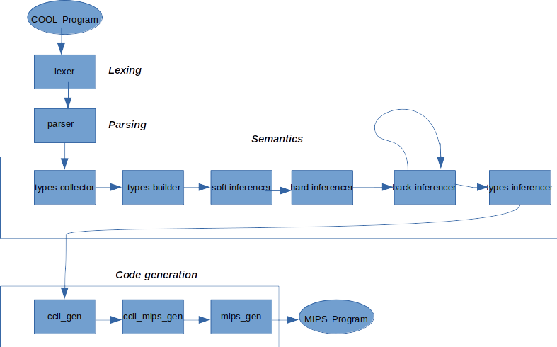
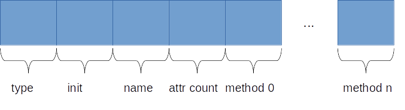
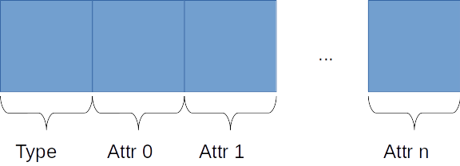

# Informe de Compilación

*Rodrigo D. Pino Trueba C412*
*Adrián Rodríguez Portales C412*

# CLI 

Para ejecutar el compilador es necesario tener instalado `typer` y `ply`.

```bash
python3 compiler <cool-program>
```

El compilador también cuenta con otras opciones a las cuales se pueden acceder si pasamos como parámetro `--help`

```bash
❯ python3 compiler --help
Usage: compiler [OPTIONS] INPUT_FILE

  Welcome to CoolCows Compiler!

Arguments:
  INPUT_FILE  [required]

Options:
  --ccil / --no-ccil          Create <program>.ccil file
                              corresponding to the ccil code
                              generated during compilation
                              [default: False]

  --cool-ast / --no-cool-ast  Print COOL AST
                              [default: False]

  --install-completion        Install completion for the current
                              shell.

  --show-completion           Show completion for the current
                              shell, to copy it or customize the
                              installation.

  --help                      Show this message and exit.
```

# Arquitectura

El compilador se diseño siguiendo una ariquitectura modular y funcional. Cada compoenente del mismo es totalmente sustituible sin afectar el funcionamiento de los demás. La imagen siguiente muestra el p*pipeline* del compilador, desde que recibe el programa de COOL hasta que genera la salida del programa correspondiente en MIPS.



La distribución del código se puede apreciar a continuación:

```
├── asts
│   ├── ccil_ast.py
│   ├── inferencer_ast.py
│   ├── __init__.py
│   ├── mips_ast.py
│   ├── parser_ast.py
│   └── types_ast.py
├── lexing
│   ├── errors.py
│   ├── __init__.py
│   └── lexer.py
├── __main__.py
├── parsing
│   ├── errors.py
│   ├── __init__.py
│   ├── parser.py
│   └── parsetab.py
└── visitors
    ├── ast_print
    │   ├── __init__.py
    │   └── type_logger.py
    ├── code_gen
    │   ├── ccil_gen.py
    │   ├── ccil_mips_gen.py
    │   ├── constants.py
    │   ├── __init__.py
    │   ├── mips_gen.py
    │   └── tools.py
    ├── semantics
    │   ├── inference
    │   ├── __init__.py
    │   ├── tools
    │   ├── type_builder.py
    │   └── type_collector.py
    └── utils
        ├── __init__.py
        └── visitor.py
```
En `asts` se encuentran cada uno de los AST que se utilizan a lo largo del proyecto. En `lexing` y `parsing` están la implementación del parser y lexer utilizados. En la carpeta `visitors` se ubican las clases que utilizan el patrón de mismo nombre para cada etapa del compilador divididos en subcarpetas. 

# Lexing

Para el proceso de *lexing* y *parsing* se usó la biblioteca de *Python* **PLY**. Esta es una implementación de las herramientas *lex* y *yacc* completamente escritas en *Python*. Para el caso particular de la tokenización, *lex* fue la herramienta utilizada. 

La implementación se encuetra en el módulo `lexer.py`. La misma cuenta con una clase `Lexer` donde se definen las expresiones regulares para cada uno de los tokens. En el caso de los *string* y comentarios multilínea se usaron dos estados distintos para cada una, debido a que estos enguajes no son regulares y era necesario usar algoritmos más potentes. 

# Parsing

Como se menciona en la sección anterior, para el proceso de *parsing* se utilizó *ply.yacc*. Esta herramienta cuenta con la misma técnica de parsing LALR que el *yacc* original.

La gramática utilizada se encuentra definida en `parser.py`. En este módulo se encuentra la clase `Parser`, la cual cual cuenta con un conjunto de métodos que representan cada una de las producciones de la gramática. Como se puede apreciar, en el caso de las operaciones aritméticas y de comparación las producciones son ambiguas, sin embargo *ply.yacc* permite desambiguar definiendo la precedencia y la asociatividad de los operadores como se muestra a continuación:

```python
self.precedence = (
	("right", "ASSIGN"),
	("right", "NOT"),
	("nonassoc", "LESSEQ", "<", "="),
	("left", "+", "-"),
	("left", "*", "/"),
	("right", "ISVOID"),
	("left", "~"),
	("left", "@"),
	("left", "."),
)
```

Esto permite usar una gramática ambigua y evita tener que definir más producciones para poder parsear.

# Semántica e Inferencia

Nuestro proyecto hace uso de `AUTO_TYPE` con la que incorpora inferencia de tipos al lenguage Cool. La inferencia se realiza varias veces en distintos vistores. En nuestra implementación debido a que le inferencia se apoya fuertemente sobre el reglas semánticas, el chequeo semántico se realiza a la par que la inferencia, y dividido de igual manera por los visitores.

La idea principal para realizar la inferencia es considerar todo declaración  `AUTO_TYPE` no como un tipo específico sino como un conjunto de tipos, donde inicialmente ese conjunto esta compuesto por todos los tipos definidos en un programa Cool. Los tipos declarados específicamente como `Int` o `String` se consideran conjuntos con un solo elemento.

En  Cool muchas veces las expresiones se ven obligadas a conformarse a un tipo definido por el usuario. Deben corresponder con el tipo definido de una variable, argumento o retorno de una función. También deben obedecer las reglas semánticas, cuando están presente frente a una operación aritmética, o en una posición donde se espera que el resultado sea `Bool`. Para reducir los conjuntos de tipos en presencia de `AUTO_TYPE` realizamos lo siguiente:

1. Cuando el tipo declarado de una variable esta bien definido (diferente de `AUTO_TYPE`) , se eliminan  del conjunto de tipos inferidos de la expresión los elementos que no conforman a dicho tipo bien definido.

2. Cuando el tipo declarado de una variable es `AUTO_TYPE`, esta se puede reducir analizando que valores debe tener para que los tipos de la expresión inferida se conformen con el.

3. Cuando ambos tipos, tanto el definido como el inferido son `AUTO_TYPES` se busca que valores puede tener el segundo para conformarse al primero, y que valores el primero para que el segundo se conforme.

Para tratar cada caso el inferenciador se divide en tres partes:

1. **soft inferencer** que aplica la primera regla y tercera regla. Se le llama **soft** porque perdona y no realiza ningún tipo de chequeo semántico y permite cosas como que un conjunto  tengo dentro de si dos tipos sin un ancestro común.
2. **hard inferencer ** aplica la primera y la tercera regla, y fuerza el chequeo semántico sobre todas las expresiones. No permite bolsas de tipos sin ancestros comunes dentro de un mismo conjunto.
3. **back inferencer** aplica la segunda y tercera regla. Dada las expresiones trata de reducir los conjuntos de los tipos definidos como `AUTO_TYPE` (e.g. parámetros de una función, retorno de una función, o declaración de  variables)
4. **types inferencer** reduce todos los conjuntos de tipos de cada nodo al mayor ancestro en todos los casos, excepto cuando se trata del valor de retorno de una función, en el que reduce al ancestro común más cercano de los tipos del conjunto.

Cada inferenciador se ejecuta secuencialmente, una sola vez, exceptuando por el **back inferencer** que puede ejecutarse tantas veces como sea necesario.


## Soft Inferencer

El **soft inferencer** es permisivo pues como es el primero en leer el programa, puede que un conjunto de tipos inválidos en la línea 5 se vuelva válido más adelante en el código.

En este ejemplo no funcional (Lanza `RuntimeError` debido a que `a` es `Void`) donde el tipo de `a`  puede ser cualquiera, al leer `a.f()`, se reducen los tipos de a de  {`Object`, `String`, `IO`, `Int`, `Bool`, `Main`, `A`, `B`} a tan solo {`A`, `B`}. No obstante `A` y `B` no tienen un ancestro común dentro del conjunto, luego `a` posee un tipo invalido. Lanzar una excepción en este momento puede crear un falso positivo pues se puede corregir más adelante ya que el programa no se ha leído completamente.

Luego cuando se lee `a.g()` el conjunto de tipos se reduce a  solo {`A`}. Estos tipos inferidos se guardan para los próximos visitores del chequeo semántico.

```c#
class Main {
	a : AUTO_TYPE;
	method main():AUTO_TYPE {
		{
			a.f();  // Boom si no es el soft inferencer
			a.g();  // Solucionado
		}
	}
}
class A {
	method f():Int{
		3 + 3
	}
	metod g():String{
		"g"
	}
	
};
class B {
	method f():String{
		"f"
	}
}
```

## Herramientas para la Inferencia

### Join

La operación `join` cuando se busca encontrar el tipo mas general entre dos bolsas de tipos, es buscar el ancestro común más cercano al que todos los tipos de ambas bolsas se conformaran. Si ese tipo se encuentra dentro de alguna de las dos bolsas se utiliza, si no, se añade.

Esta operación se utiliza sobre los expresiones `if` y `case of`.

### Conform 

`conform`  se utiliza para saber si una bolsa de tipos `a` conforma con otra `b`, se analizan todos sus subtipos de `a` y se desechan los que no conformen con ningún subtipo de `b`.

Se ejecuta durante el chequeo del **soft inferencer** y el **hard inferencer**, para reducir el tipo de las expresiones a base de un tipo declarado o una regla semántica.

### Unify

Con `unify` se halla la intersección entre dos bolsas de tipos. Se ejecuta en el **back inferencer** para reducir las tipos declarados a partir de las expresión inferida.

## SELF_TYPE

Los `AUTO_TYPE` no incluyen dentro de su bolsa de tipo al tipo especial `SELF_TYPE`.

La combinación de `SELF_TYPE` con `AUTO_TYPE` trajo sus problemas, sobre todo porque funciona como un comodín que puede tener un tipo dependiendo de las circunstancia. Logramos una mejor integración entre estos fue posible intercambiando el `SELF_TYPE` por el tipo según donde se estuviera analizando el código. Después se intercambiaba para atrás, en caso de que no se pueda, significa que no cumple las reglas de la semántica y se lanza como error después de finalizada la inferencia.

# Generación de Código Intermedio

Para producir código CIL se toma como principal el guía el capitulo 7 del libro de `Cool Compilers`.

El programa original se divide en tres secciones:

*  En **types** se  guarda la signatura de los tipos. Nombre de atributos y funciones.
*  **data** almacena todos los `String` definidos en tiempo de compilación por el usarion así como `Strings` definidos durante la propia generación de código. 
*  En **code** se encuentra el equivalente en CIL de las funciones definidas en Cool. Cada función en vez de tener expresiones y sub-expresiones complejas tienen una secuencia de operaciones más sencillas que producen un resultado equivalente.

## Types

Contiene solo el nombre de la clase, los métodos y su identificador único para buscarlo cuando se necesite llamar a un método y los atributos de la misma. Los tipos también contienen dentro de ellos los atributos de las clases que heredan al igual que sus funciones.

Para todas las clases se les genera una función `init` donde se inicializan los valores iniciales de todos sus atributos. Si el atributo no esta inicializado, se inicializa por defecto apuntando a la cadena vacía en caso de ser de tipo `String` o con valor 0 en otro caso.

En caso de que el atributo se inicialice con una expresión, se transforma a operaciones en CIL y se le asigna el resultado final al atributo correspondiente.

La función `init` se ejecuta siempre que se  instancie una clase.

## Data

Se almacenan todos las cadenas definidos por el usuario en el programa Cool. Ademas se tiene también la cadena vacía  a la cual apuntan las variables  `String` sin inicializar. Durante la generación de código se almacena aquí además los mensajes de errores en ejecución.

## Code

Cada expresión de Cool se representa como una  secuencia de operaciones en CIL. Se asegura siempre que dentro de esa secuencia haya una instrucción que guarde en una variable local el resultado final de dicha expresión. 

La secuencia de instrucciones de una expresión varían de acuerdo a las secuencias de instrucciones de sus  sub-expresiones respectivas. Para producir código CIL a partir de una expresión:

1. Produce las operaciones de todas sus sub-expresiones
2. Produce las operaciones propias. Cuando se necesite el valor de una sub-expresión se busca la variable local que almacena el resultado final de dicha sub-expresión.
3. Organiza las operaciones propias y de sus sub-expresiones de una manera que tenga sentido
4. Finalmente crea una variable local donde se almacene el valor final propio.

En CIL se trata de desglosar las expresiones en las instrucciones con el nivel más bajo posible. Existen casos para lo cual lo anterior no es posible como la comparación de  `String`  y las operaciones `built-in` que se realizan sobre estos.

Se añaden `warnings` al compilador cuando el programador tiene una expresión permitida, pero sin sentido, como `isVoid 3`, o algún otro tipo que no pueda ser `Void`.

Durante la generación de código se genera también las excepciones que pueden ser lanzadas durante la ejecución:

+ División por cero
+ El despacho ocurre desde un tipo sin inicializar (`Void`)
+ El rango del substring no es válido
+ La expresión del `case of` es `Void`
+ Ninguna rama de algún `case of` es igual al tipo de la expresión

Es posible para el usuario definir variables con mismos nombres con distintos contextos, para tratar con esto se reutilizan una versión simplificada del `Scope` de la semántica, donde se almacenan según el contexto la variable definida por el usuario y su traducción a Cool. Esto permite que en el ejemplo siguiente se conozca siempre  a que variable `x` se refiere el programa:

```assembly
# COOL
let x:int = 3
    in (let x:int = 4 in x) + x
# CIL
local let_x_0
local let_x_1

let_x_0 = 3
let_x_1 = 4
...
```

### Transformaciones

Ejemplos de traducción de Cool a CIL

#### Declaración de Clase

 **Cool Input**

```haskell
class C {
	-- Initialized attributes
    a1: <attr_type> <- <expression>;
    a2: <attr_type> <- <expression>;
    ...
    am: <attr_type> <- <expression>;

    -- Functions
	f1(<param_list>) { <expression> }
    f2(<param_list>) { <expression> }
    ...
    fn(<param_list>) { <expression> }

}
```

**CCIL Output**

```assembly
type C {
	attribute a1;
	...
	attribute am;

	method f1 : <func_code_name>;
	...
	method fn : <func_code_name>;
}
```

#### Herencia de Clases

 **Cool Input**

```haskell
class A {
	a1:<attr_type>
	f1():{...}
}

class B inherits A {
	b1:<attr_type>
	g1():{...}
}
```

**CCIL Output**

```assembly
type A {
	attr a1;
	method f1 : f_f1_A
}

type B {
	attr a1;
	attr b1;
	method f1: f_f1_A
	method g1: f_g1_B
}
```

#### While Loop

**Cool Input**

```assembly
while (<cond_expr>) loop <expr> pool
```

**CCIL Output**

```assembly
label while_init
x = <resultado_numerico_de_cond_expr>
ifFalse x goto while_end

<do_body_expr>

goto while_init
label while_end
```

#### If Then Else

**Cool Input**

```
if <if_expr> then <then_expr> else <else_expr> fi
```

**CCIL Output**

```assembly
<do_if_cond_expr> # Produce todas las operaciones de la expr de la cond. inicial
x = <if_cond_expr_result>  # Guarda ese valor
ifFalse x goto else_expr 
# x = 1
<do then_expr>
f = <then_expr_result> # El resultado final de la expresion if
goto endif

# x = 0
label else_expr
<do_else_expr>
f = <else_expr_result> # El resultado final de la expresion if

label endif
```

#### Let In

**Cool Input**

```
let <id1>:<type1>, ... <idn>:<typen> in <expr>
```

**CCIL Output**

```assembly
# Inicializa todas las variables let, tengan expresión o no
<init_let_var1>
<init_let_var2>
...
<init_let_varn>
# traduce la expresion en operacions
<do_in_expr>
f = <in_expr_fval> # Almacena el resultado final de la expresion let
```

#### Case Of

Para los `case of` las ramas desde la semántica son organizadas para que los tipos más general se quede siempre al fondo.

Durante la generación de código de la expresión `case of`, cuando se busca si conforman con el tipo`A` se compara también con todos sus subtipos. Se le añade la optimización que si ya existe ese subtipo de `A` declarado en el `case of` entonces no se añade nuevamente.

Para el caso de `Object` específico no se compara con ningún subtipo, sencillamente se pone la operación `goto`

**Cool Input**

```
case <case_expr> of
	<id1>:<type1> => <expr1>
	<id2>:<type2> => <expr2>
	...
	<idn>:<typen> => <exprn>
esac
```

**CCIL Output**

```assembly
<init id1>
<init id2>
...
<init idn>

<do_case_expr>
x = <case_expr_result>
t = typeof x

# Analiznado rama 1
t1 = typeof <id1>
b1 = t1 == t # Comparando tipos
if b1 goto branch1: # En caso de exito ve a la rama

# Analizando rama 2
t2 = typeof <id2>
b2 = t2 == t
if b2 goto branch2

...

# Analizando rama n
tn = typeof <idn>
bn = tn == t
if bn goto brannch

<throw_runtime_exception> # Lanza una excepcion en ejcucion si no se ejecuta ninguna rama


# Realizando logica the rama1
label branch1
<do_expr1>
goto end_case

# Realizando logica the rama2
label branch2
<do_expr2>
goto end_case

...

# Realizando logica the raman
label branchn
<do_exprn>
goto end_case

label end_case
```

#### Despacho Dinámico 1

**Cool Input**

```
<func_id>(<arg1>, <arg2>, ..., <argn>);
```

**CCIL Output**

```assembly
<init self> # EL primer argumento es el objeto desde el que se llama
<init arg1>
<init arg2>
...
<init argn>
r = vcall <func_id> 
```

#### Despacho Dinámico 2

**Cool Input**

```
<expr>.<func_id>(<arg1>, <arg2>, ..., <argn>);
```

**CCIL Output**

```assembly
# Se realiza la expresion
<init_expr_locals>
<do_expr>

<init expr_fval> # El primer argumento es una variable local con el tipo de la expresión
<init arg1>
<init arg2>
...
<init argn>
r = vcall <func_id> 
```

#### Despacho Estático

**Cool Input**

```
<expr>@<type1>.<func_id>(<arg1>, <arg2>, ..., <argn>);
```

**CCIL Output**

```assembly
# Se realiza la expresion
<init_expr_locals>
<do_expr>

t = allocate <type1> # Crea el tipo donde se busca la funcion por su nombre único

<init expr_fval> # El primer argumento es una variable local con el tipo de la expresión
<init arg1>
<init arg2>
...
<init argn>
r = ccall t <func_id>  n
```

#### Declaración de un método

**Cool Input**

```
<function_id>(<par1>:<type1>, ..., <parn>:<typen>) : <return_type>
{
	<function_expression>
}
```

**CCIL Output**

```assembly
function <function_id> {
	param <par1>
	param <par2>
	...
	param <parn>
	local <id1>
	local <id2>
	...
	local <idn>
	<do_expresion>
	r = <expression_result>
	return r
}
```

#### Expresión de Bloque

**Cool Input**

```
{
	<expr1>;
	<expr2>;
	...
	<exprn>;
}
```

**CCIL Output**

```
<init expr1 locals>
<init expr2 locals>
...
<init exprn locals>

<do_expr1>
<do_expr2>
...
<do_exprn>
```

#### Expresiones Aritméticas

**Cool Input**

```c#
3 + 5
```

**CCIL Output**

```
t = 3 + 5
```

---

###### Varios operadores

**Cool Input**

```
3 + 5 + 7
```

**CCIL Output**

```assembly
t1 = 5 + 7
t2 = 3 + t1
```

---

###### En operaciones no conmutativas

```python
3 - 5 - 7
# -2 -7
# -9
```

```assembly
t1 = 3 - 5
t2 = t - 7
```

---

**Cool Input**

```
100 / 20 / 5 / 2
```

**CCIL Output**

```
t1 = 100 / 20
t2 = t1 / 5
t3 = t2 / 2
```


## Lenguaje CCIL

Definición del lenguaje CCIL(Cool Cows Intermediate Language). Tomamos como No Terminales sólo las palabras que empiecen con  mayúsculas. El resto de palabras  y símbolos se consideran como Terminales.

$$
\begin{array}{rcl}
\text{Program} &\rarr& \text{.type TypeList .code CodeList}\\
\text{TypeList} &\rarr& \text{Type } | \text{ Type TypeList}\\
\text{Type} &\rarr& \text{FeatureList}\\
\text{FeatureList} &\rarr& \text{Attribute } | \text{ Function } | \text{ FeatureList } | \space\epsilon\\
&|& \text{ Attribute; FeatureList } | \text{ Function; FeatureList}\\
\\
\text{CodeList} &\rarr& \text{ FuncCode CodeList }| \space\epsilon \\
\text{AttrCode} &\rarr& \text{id }\{ \text{LocalList OperationList} \}\\
\text{FuncCode} &\rarr& \text{id }\{\\
&&\text{ParamList}\\
&&\text{LocalList}\\
&&\text{OperationList} \text{\}}\\
\\
\text{OperationList} &\rarr& \text{Operation; OperationList } | \space\epsilon \\
\text{Operation} &\rarr& \text{id = ReturnOp}\\
&|& \text{goto id}\\
&|& \text{label id}\\
&|& \text{return Atom}\\
&|& \text{setattr id id Atom}\\
&|& \text{if Atom goto id}\\
&|& \text{ifFalse Atom goto id}\\
&|& \text{arg id}\\

\text{ReturnOp} &\rarr& \text{Atom + Atom}\\
&|& \text{Atom - Atom}\\
&|& \text{Atom * Atom}\\
&|& \text{Atom / Atom}\\
&|& \text{not Atom}\\
&|& \text{neg Atom}\\
&|& \text{call id}\\
&|& \text{vcall typeId id}\\
&|& \text{typeof id}\\
&|& \text{getatrr id id}\\
&|& \text{allocate typeId}\\
&|& \text{Atom < Atom}\\
&|& \text{Atom <= Atom}\\
&|& \text{Atom = Atom}\\
&|& \text{allocate typeId}\\
&|& \text{getattr id id}\\
&|& \text{Atom}\\
\text{Atom} &\rarr& \text{Constant } | \text{ id}\\
\text{Constant} &\rarr& \text{ integer } | \text{ string }
\end{array}
$$

# Generación de código MIPS

Una vez definido un lenguaje intermedio, se pasa a MIPS. En este punto del proceso de compilación se tuvieron que resolver dos problemas fundamentales: la semántica de tipos y el manejo de la memoria. 

## Representación de los tipos

En *MIPS* las instancias de clases se representan a través de información estática y dinámica. La parte estática se define en la sección *.data* y contiene la información que se comparte entre cada uno de los objetos del mismo tipo.



La sección `type` contiene la dirección hacia esa sección de código. En `init` se encuentra la dirección de una función especial que inicializa una instancia cualquiera de la clase correspondiente. Esta función se genera en ccil. Luego, en la sección `name` se encuentra la dirección del *string* que corresponde al nombre del tipo. En `attr count` se encuentra un valor que representa la cantidad de atributos que tiene la clase. Después de esta porción de memoria se encuentran los métodos, es decir, las direcciones de las funciones que implementan cada uno de los métodos en una clase. 

Es importante señalar que los métodos de las clases están declarados en el mismo orden. Si una clase `B` hereda de otra clase `A`, los métodos de `A` que `B` hereda están en la misma posición que en `A`. De este modo los llamados a métodos virtuales se pueden hacer conociendo solamente el tipo estático del objeto y el *offset* del método que se está invocando.

En el caso de las instancias de los tipos, su representación en memoria es como se muestra a continuación:



En la sección `type` se encuentra la dirección hacia la información estática del tipo que se mencionó anteriormente. Luego le siguen cada uno de los atributos. Estos, al igual que en el caso de los métodos, se encuentran en el mismo orden para todas las instancias de una clase y de sus subclases. De este modo la lectura y escritura de los atributo se reduce a saber su tipo estático y el *offset* del atributo.

## Llamados a función

Para los llamados a función en MIPS se tomó como convenio pasar primeramente los argumentos a través de la pila ( el primer argumento siempre es la instnacia del objeto que realiza el llamado ) para luego saltar al *label* donde se encuentra la definición de la función. A continuación se guardan en la pila el *return address* y el *frame pointer*. Una vez hecho esto se ajusta el nuevo valor del *frame pointer*  y se reserva el espacio necesario para las variables locales en la pila. Cuando se realizan cada una de las opraciones correspondientes a la función invocada se sacan de la pila los valores anteriores del *return address* y *frame pointer*, y se libera el espacio correspondiente a las variables locales y los argumentos de la función. Los valores de retorno de las funciones se guardan siempre en el registro `v0`.

## new SELF_TYPE

Como se había mencionado anteriormente, cuando se instancia un nuevo objeto, sabiendo el tipo podemos llamar directamente a la función  `init` correspondiente y reservar la cantidad de memoria necesaria. Sin embargo, en el caso del `SELF_TYPE`, no se puede proceder como en los demás casos, porque el tipo del objeto que se va a instanciar solo se conoce en tiempo de ejecución. Por tanto, para resolver este problema, lo que se hace es buscar el tipo dinámico del objeto donde se encuentra la invocación del método actual que porsiempre se encuentra en el primer argumento del llamado a una función en MIPS, y a través del cual se puede obtener el tipo del objeto (identificador realmente ) y así acceder a la información estática de dicho tipo, donde se puede saber la cantidad memoria necesaria a reservar según la cantidad de atributos y a la función `init` que le corresponde.


### Funciones Built-in

Las funciones *built-in* se implementaron directamente en el AST de MIPS.
