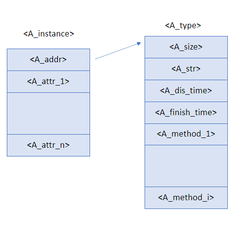
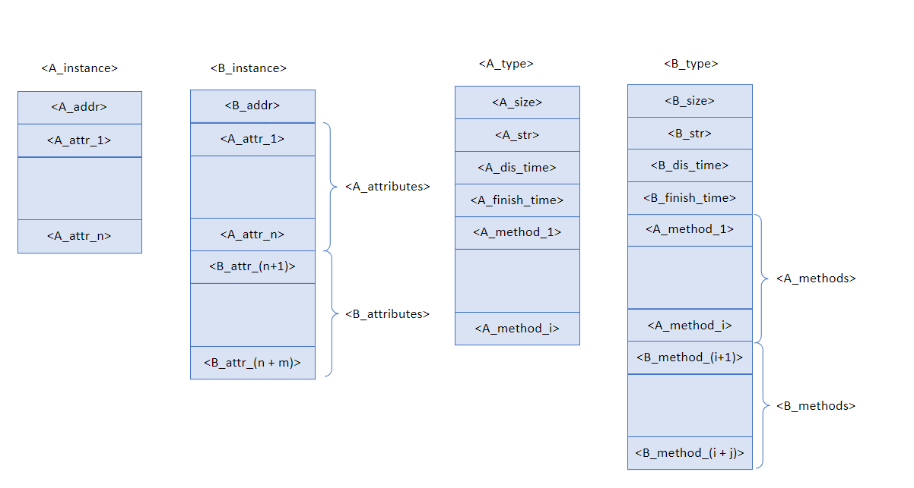

# Cool Compiler


## 1. Uso del compilador

Para usar el compilador, solo se debe ejecutar el siguiente comando en una consola abierta dentro de la carpeta src:

```
python3 cool.py <path_cool_file>
```


## 2. Arquitectura del compilador

El objetivo del presente software es dado un programa escrito en el lenguaje COOL generar un programa equivalente escrito en MIPS que pueda ser ejecutado en SPIM. 

El proceso de convertir lenguaje COOL a lenguaje MIPS se dividió en un total de 5 fases repartidas en 3 fases principales:

- Parsing
  - Análisis Léxico
  - Análisis Sintáctico
- Análisis semántico
- Generación de código
  - Generación de CIL
  - Generación de MIPS

Cada una de estas fases principales se corresponde con un módulo del compilador encargado de su ejecución por lo que la estructura del compilador sería la siguiente.
```
src/
┣ codegen/
┣ parsing/
┣ semantics/
┣ utils/
┗ cool.py
```
Por último el archivo `cool.py` se encarga de crear el *pipeline* entre el archivo de entrada, los módulos del compilador y el archivo de salida siguiendo el flujo mostrado en la siguiente imágen.


## 3. Módulos del compilador

### 3.1 parsing

El proceso de parsing del programa se divide en dos fases: el análisis lexicográfico y el análisis sintático. Para la implementación de este módulo se decidió utilizar `ply` el cual es una implementación en python de las herramientas de construcción de compiladores `lex` y `yacc`. Este módulo recibe como entrada un string y en caso de dicho string pertencer al lenguaje COOL devuelve el árbol de sintaxis abstracta del programa, en caso negativo devuelve una lista con los errores encontrados.


**Análisis lexicográfico:**

-----

Utilizando la herramienta `lex` se implementó el tokenizador de texto utilizando expresiones regulares para reconocer los tokens, esto resulta conveniente dado que la mayoría de componentes del lenguaje son reconocibles mediante estas, no obstante existen excepciones como los comentarios (multilínea y de una sola línea) y los strings debido a que estos elementos se defininen como un lenguaje de la forma $a^nb^n$. Para estos casos especiales se optó por reconocer el símbolo inicial del elemento y luego procesar el resto del texto sin utilizar el autómata hasta encontrar el símbolo que cierra el elemento para luego reanudar el procesamiento utilizando el autómata.

**Análisis sintáctico:**

----

La herramienta `yacc` permite la creación de parsers con gramáticas LALR(1) y la construcción del árbol de sintaxis abstracta mediante gramáticas atributadas. En esta fase se definió la gramática y la jerarquía de clases a utilizar para construir el AST.

A continuación definimos la gramática LALR(1) utilizada.

```
S -> program
program -> class_list
class_list -> def_class
class_list -> dec_class class_list
def_class -> CLASS TYPEID OCUR feature_list CCUR SEMICOLON
feature_list -> ε
feature_list -> def_attr feature_list
feature_list -> def_func feature_list
def_attr -> OBJECTID COLON TYPEID SEMICOLON
def_attr -> OBJECTID COLON TYPEID ASSIGN exp SEMICOLON
def_func -> OBJECTID OPAR CPAR COLON TYPEID OCUR exp CCUR SEMICOLON
def_func -> OBJECTID OPAR param_list CPAR COLON TYPEID OCUR exp CCUR SEMICOLON
param_list -> param
param_list -> param COMMA param_list
param -> OBJECTID COLON TYPEID
exp -> OBJECTID ASSIGN exp
exp -> LET ident_list IN exp
iden_list -> iden
iden_list -> iden COMMA ident_list
iden -> OBJECTID COLON TYPEID
iden -> OBJECTID COLON TYPEID ASSIGN exp
case_list -> branch
case_list -> branch case_list
branch -> OBJECTID COLON TYPEID CASSIGN exp SEMICOLON
exp -> NOT exp
exp -> comp
comp -> arith
comp -> arith LOWER arith
comp -> arith LEQ arith
comp -> arith EQUAL arith
comp -> arith EQUAL NOT exp
arith -> term
arith -> arith PLUS term
arith -> arith MINUS term
term -> factor
term -> term STAR factor
term -> term DIV factor
factor -> atom
factor -> TILDE factor
factor -> CASE exp OF case_list ESAC
factor -> WHILE exp LOOP exp POOL
factor -> OCUR exp_list CCUR
exp_list -> exp SEMICOLON
exp_list -> exp SEMICOLON exp_list
factor -> IF exp THEN exp ELSE exp FI
factor -> ISVOID factor
atom -> INT_CONST
atom -> STRING_CONST
atom -> TRUE
atom -> FALSE
atom -> OBJECTID
atom -> NEW TYPEID
atom -> func_call
atom -> OPAR exp CPAR
func_call -> OBJECTID OPAR arg_list CPAR
func_call -> atom DOT OBJECTID OPAR arg_list CPAR
func_call -> atom AT TYPEID DOT OBJECTID OPAR arg_list CPAR
arg_list -> ε
arg_list -> arg_list_not_empty
arg_list_not_empty -> exp
arg_list_not_empty -> exp COMMA arg_list_not_empty
```

### 3.2 semantics

El módulo `semantics` implementa la fase de análisis semántico del compilador, este recibe como entrada el árbol de sintaxis abstracta producido por el parser y tiene como salida una lista de errores, la cual si es vacía indica que el programa es válido.

**Análisis semántico**

-----

Para realizar el análisis se definieron 3 clases las cuales implementan un patrón *visitor* para recorrer el AST, cada una de estas clases realiza un recorrido sobre el árbol comprobando distintas reglas del lenguaje en cada caso.

1. `TypeCollector`: este primer recorrido es el encargado de recolectar los identificadores de los tipos definidos por las clases declaradas en el código y verifica que no hayan clases que tengan con el mismo nombre.
   
2. `TypeBuilder`: es el encargado de validar las declaraciones hechas dentro de los tipos creados en el recorrido anterior. Verifica que los atributos y métodos declarados no sean redefinidos dentro de la misma clase y que los tipos presentes en estas definiciones existan. Además realiza comprobaciones de integridad sobre la jerarquía de tipos comprobando la no existencia de ciclos en la herencia y que toda clase base haya sido definida.
   
3. `TypeChecker`: se encarga de analizar el cuerpo de las definiciones de los métodos y las expresiones de las definiciones de los atributos de las clases. Se analiza la signatura de los métodos para validar la reescritura de métodos en casos de herencia y. que los atributos heredados no se encuentren definidos nuevamente. Además comprueba que las reglas de cálculo de tipos para expresiones definidas en el manual del lenguje COOL. 

Para la realización de estos recorridos fue necesaria la implementación de representaciones de los elementos semánticos del programa como los tipos (`Type`), atributos (`Attribute`), métodos (`Method`), etc... además de contenedores que nos permitiesen acceder a esta información de una forma efectiva y sencilla como `Context` y `Scope`. Estas clases se encuentran en el archivo `semantic.py` y fueron implementadas siguiendo las ideas del temario de análisis semántico visto en el curso.

Luego de haber realizado los diferentes recorridos por el AST el módulo devuelve una lista la cual contiene los errores semánticos encontrados en el programa.


### 3.3 codegen

Luego de comprobar que el código porporcionado por el usuario no contenga errores, se procede a la generación de código de máquina. 

La generación de código está dividida en dos partes: primero se genera un código intermedio CIL y luego, a partir de este, se genera el código MIPS. Esto nos va a permitir generar código del programa de forma más sencilla, ya que el salto directamente desde COOL a MIPS es demasiado complejo. El AST devuelto por el parser se recorre y se van formando los nodos de un nuevo AST con nodos que representan las definiciones, instrucciones y expresiones de CIL. Por último, a partir de este AST se procede a generar el código MIPS en donde se incluye el trabajo con la memoria.


**Generación de código CIL**

-----

EL lenguaje CIL está dividido en tres secciones:

**1.**   type:  Se definen los tipos (clases) con sus atributos y el encabezado de sus métodos como se explica en la bibliogarfia de la asignatura.  

Se conoce que el ast producido por el parser tiene como nodo raíz un ProgramNode que está formado por nodos ClassDeclarationNode que son las clases, y estos a su vez por nodos AttrDeclarationNode y FunctionDeclarationNode que son las definiciones de los atributos y los métodos de una clase. Cuando se visita un ClassDeclarationNode, se crean los nodos CILTypeNode que contienen una lista de CILAttributesNode y una lista de CILMethodNode, los cuales solo contienen el nombre del método y el nombre de la función que lo define en la sección code.

```
type A {
   attribute x ;
   method f : f1;
}
```

Como se sabe los métodos y los atributos de un tipo deben siempre definirse en un mismo orden y si un tipo A hereda de B, A debe tener acceso a los atributos y métodos de su padre y de los demás ancestros de él hasta llegar a Object. Para lograr esto se tomaron en orden topológico todos los nodos de las clases y al recorrerlo se fueron agregando los atributos del padre y métodos en el mismo orden, y por último los suyos. De esta forma, cuando se llega a un nodo su padre tiene ya todos sus atributos y métodos definidos, asi como los del los ancestros en orden de aparición. Además, para una mayor comodidad en la implementación, todas las variables o atributos almacenan un tipo además de su nombre, dejando el trabajo de la memoria para la segunda fase de generación.  

Además a cada tipo se le añade un método especial, el init, que va a ser llamado cada vez que se inicialice una clase usando la expresión `new` desde el código de COOL. Por cada atributo declarado en la clase y que se le asigna una expresión, se van a añadir las instrucciones responsables de inicializar esos valores. Este método va a ser invocado pasándole como argumento la referencia de la variable a la que se le desea asignar este tipo. 

Los tipos built-in quedan implementados de la siguiente forma:

```
type Object {
        method init : init_Object;
        method abort : abort_Object;
        method type_name : type_name_Object;
        method copy : copy_Object;
}

type Int {
        attribute value;
        
        method init : init_Int;
        method abort : abort_Object;
        method type_name : type_name_Object;
        method copy : copy_Object;
}

type String {
        attribute value;

        method init : init_String;
        method abort : abort_Object;
        method type_name : type_name_Object;
        method copy : copy_Object;
        method length : length_String;
        method concat : concat_String;
        method substr : substr_String;
}

type Bool {
        attribute value;

        method init : init_Bool;
        method abort : abort_Object;
        method type_name : type_name_Object;
        method copy : copy_Object;
}

type IO {
        method init : init_IO;
        method abort : abort_Object;
        method type_name : type_name_Object;
        method copy : copy_Object;
        method out_string : out_string_IO;
        method out_int : out_int_IO;
        method in_string : in_string_IO;
        method in_int : in_int_IO;
}
```


**2.**   data:  En esta sección se guardan los string que se van encontrando en el AST y se almacenan en una variable para su posterior uso.

**3. **  code: Esta sección contiene la definición de todas las funciones, sus parámetros, las variables locales que se utilizan y el retorno.

Un FunctionDeclarationNode en el AST devuelto por el parser se convierte en CIL en un CILFuntionDeclarationNode que está formado por tres secciones: `params` en donde están todos los parámetros de la función declarada, la sección `local` donde se crean las variables locales e `instructions` donde se encuentran las instrucciones a ejecutar.  Para crear las variables se utiliza un alias que depende de su nombre original, esto se realizó porque una variable de un método o un argumento pueden  llamarse como un atributo de la clase y a la vez en una expresión let pueden redefinirse nombres de variables que estén en los parámetros o en otro let más externo, este alias posibillita que la variable al crearla sea única y no sobrescriba variables creadas en otro entorno accesible. 

Como se conoce en el lenguaje COOL solo existen expresiones y en el lenguaje CIL se tienen tanto expresiones como instrucciones, por tanto una expresión COOL se traduce a una lista de instrucciones CIL ya sean de asignación o de cambio del valor de un atributo, ifgoto, goto, label, entre otras. Una asignación en CIL puede ser la traducción de una `asignación` de COOL  o puede ser creada para llevar una expresión de COOL distinta de asignación a una instrucción en CIL, un ejemplo es cuando queremos realizar una operación suma en COOL y una de las partes (izquierda o derecha) no es un nodo atómico, debemos separar en en una asignación a una nueva variable creada en CIL que guarde la expresión de esa parte que y luego a esta sumarla con la parte que si es atómica, lo mismo pasa para todas las expresiones binarias.

Un caso de especial consideración dentro de las expresiones de COOL es el `case`, el comportamiento esperado es que se compute el tipo dinámico de la expresión de del `case` y se seleccione la rama del tipo ancestro más cercano a dicho tipo. Para resolver esto se recorrieron las ramas del case en orden topológico inverso de acuerdo a su tipo, por lo que visitamos los tipos más especializadas primero, y por cada de rama generamos código para que los descendientes que no tienen una rama asignada sean dirigidos a esta rama. Al final se genera el código de la expresión resultado de cada rama. A continuación presentamos un sencillo pseudocódigo con la idea general del algoritmo

```
branches = {}
for type in reversed_toplogic_order(case.types):
    branches[type] = type
    for heir in type.heirs():
        try:
            branches[heir]
        except:
            branches[heir] = type

for type, branch_type in branches:
    assign_branch(type, branch_type)

for branch in case:
    generate_code()
```

La conversión de la lógica del `loop`, así como la del `conditional`, a código CIL fue muy sencilla. Con la ayuda de los labels y de las expresiones ifGoto y goto se decidía cuales eran las próximas instrucciones a ejecutar haciendo saltos en el código. 

En el caso de una expresión `block` en cool , para llevarla a CIL recorremos todas las expresiones que la compongan, cada una sabe cómo convertirse al lenguaje CIL y luego retornamos la que devolvió la última expresión del `block`. 

En el caso del `let` se debe crear un nuevo ámbito de variable que te permita definir varibles que ya están definidas  y a la ves utilizar las anteriores creadas, luego se crean tantas variables como tenga el `let` y también para cada una de las expresiones de las mismas y a estas se les asigna lo que devuelve cada una de las expresiones y luego se procede a crear una nueva variable que guarde lo que retorne el recorrido que se le realiza a la expresión in del `let `. 

Las asignación es un caso importante, ya que tiene la tarea de verificar a qué tipo de variable es a la que se le asigna un valor. Por tanto, primero la busca en el scope y en caso de no encontrarse es un atributo, por lo que la instrucción a ejecutar es un `set attribute` ; en otro caso es un `assign`.

Para las expresiones unarias en el caso del `prime` lo que se hace es restarle al valor cero la expresión que devuelve el recorrido de la expresión del `prime`, en el caso del `not` se devuelve una nueva variable que guarda el valor de un nuevo NodoCIL CILNotNode que guarda la expresión del `not` la segunda parte de generación de código es el encargado de procesar dicha expresión. En la expresión `isvoid` se recorre la variable y se crea una nueva para asignarle el resultado de este proceso para luego esta pasarla como parámetro y llamar a una función creada llamada `isvoid` que se implementará en la segunda parte de generación de código. El proceso de llamado de funciones en CIL a traves de las expresiones VCALL o CALL estas se utilizan en dependencia de cómo lo necesite la segunda parte de generación de código.

Cuando se encuentra un nodo string en el ast se agrega a la sección .`data` y para utilizarlo se utiliza la función `load` de CIL que es agregada a  la lista de instrucciones. Para los valores boleanos se crean un expresión `equals`  entre 0 y 1 para el False y entre 0 y 0 para el True , esta expresión se le asigna a  una nueva variable y es lo que se retorna. En el caso de las variables si esta es un atributo se crea una nueva variable que se e asignará el resultado de  hacer `get attr` y si es una varible local se busca en el scope. Cada vez q se crea una varible esta se añade al scope y a esta se le asigna el valor de una expresión que esta expresión es un nuevo nodo creado que pertenece al lenguaje CIL, estas asignaciónes se añaden a la lista de instrucciones al igual que aquellas instrucciones de CIL que se necesitan para convertir una expresión del leguaje COOL a CIL.

**Generación de código MIPS**

----


La generación de código MIPS se realiza mediante dos recorridos al árbol de sintaxis abstracta del lenguaje CIL, el primer recorrido se encarga de construir la información de las estructuras en memoria utilizadas por el compilador y el segundo recorrido genera el código utilizando la información contextual generada por el primero.

El primer recorrido del AST del lenguaje CIL se realiza con el objetivo de crear un objeto `MIPSContext`, en esta clase almacenaremos la información relativa a la representación en memoria de los tipos, sus instancias y del manejo de memoria durante el llamado de funciones.

A continuación definiremos las ideas seguidas para la representación de los tipos en memoria.
1. El valor de los atributos de una clase son independientes para cada instancia de la clase, sin embargo, los métodos de la clase son globales para todas las instancias. Esto permite separar la información global del tipo en memoria estática y la información de las instancias en memoria dinámica.

2. Los identificadores de las clases en COOL son únicos y por tanto los identificadores de los tipos también lo son. Esto permite utilizar su nombre como alias a la dirección de memoria donde se almacena la información del tipo. La información que se decidió almacenar sobre los tipos fue su tamaño (para la creación dinámica de instancias mediante `copy`), su representación como string (para la implementación de `type_name`) y las direcciones de los métodos del tipo.
   
    ```mips
        .data
    <type_str> : .asciiz <type_str_value>
        .data
        .align 4 
    <type_id>: .word <type_size> <type_str> <method_1> ... <method_n>
    ```

3. La representación de una instancia de tipo `<type>` es un bloque de memoria de tamaño `<type_size>` localizado en memoria dinámica. La primera palabra de este bloque contienen la dirección representada por `<type_id>` las siguientes palabras del bloque contienen direcciones de memoria apuntando al valor de los atributos de la instancia en el orden en que fueron declarados.

    

4. El orden de los atributos y métodos en un tipo debe de respetar el orden en que se declaran en su tipo padre. Esto permite definir reglas precisas para obtener las direcciones de los atributos y métodos.

    $$
    attribute\_address_i = 4i + instance\_address\\
    method\_address_i = 4(i + 1) + type\_address
    $$

    Nos referiremos a este índice $i$ como offset.
    
    A continuación mostramos un ejemplo de la representación de la herencia en memoria.

    

Esta representación se implementa como una clase `TypeInfo` la cual ofrece métodos para el cálculo de las direcciones en memoria de los atributos y métodos.

```python
class TypeInfo:
    def __init__(self, typex: CILTypeNode):
        # This is obvious 
        self.id = typex.id

        # Memory to allocate for an instance of the type
        self.size = (len(typex.attributes) + 1) * WSIZE 

        # Use this offset to calculate the attribute address
        self.attrs_offset = {attr.id : i for i, attr in enumerate(typex.attributes, start=1)} 

        # Use this offset to calculate the method address
        self.methods_offset = { m.id : i for i, m in enumerate(typex.methods, start=1) }
         
    def get_attr_addr(self, attr, register):
        offset = self.attrs_offset[attr]
        return f'{(offset) * WSIZE}({register})'
    
    def get_method_addr(self, method, register):
        offset = self.methods_offset[method]
        return f'{(offset + 1) * WSIZE}({register})'
```
Otro aspecto fundamental a tener en cuenta durante la generación de MIPS es el manejo de memoria durante el llamado a funciones, para la resolución de este problema es común la adopción de convenciones por lo que en este caso nos hemos adherido a las convenciones propuestas por `gcc`. Estas convenciones se definen en torno a una estructura llamada *procedure call frame* la cual definimos a continuación.

Un *procedure call frame* es un bloque de memoria localizado en la pila el cual se encarga de proveer espacio para las variables locales del procedimiento, además su dirección es utilizada para acceder a los argumentos de la función.

Convenciones seguidas por la función que llama a otra (*caller*):

1. Guardar todos los registros utilizados los cuales puedan ser modificados por la función llamada.
2. Pasar los argumentos a la función llamada a través de la pila respetando el orden en que fueron declarados.
3. Llamar a la función.
4. Restablecer el estado de la pila extrayendo los argumentos pasados y los registros guardados


Convenciones seguidas por la función que es llamada (*called*):

1. Guardar la dirección de retorno en la pila `$ra`
2. Guardar el puntero al bloque en la pila `$fp` 
3. Actualizar `$fp` con el valor de `$sp`
4. Restar el tamaño del call frame a `$sp`
5. Realizar sus instrucciones
6. Actualizar `$sp` con el valor de `$fp`
7. Restaurar el puntero al bloque de la pila `$fp`
8. Restuarar la dirección de retorno en la pila `$ra`

Debio a estas convenciones el offset de los argumentos se calcula teniendo en cuenta la estructura LIFO de la pila por lo que el último argumento tiene offset 1 y los parámetros su offset se va asignando de forma ascendente respecto al orden al cual fueron declarados empezando desde 0, obteniendo así expresiones para el cómputo de las direcciones de argumentos y parámetros.

$$
        arg\_addr_i = 4(i + 2) + frame\_addr\\
        param\_addr_i = -4i + frame\_addr
$$

Esta estructura es implementada por la clase `ProcCallFrame` la cual permite el cálculo de direcciones de argumentos y parámetros.

```python
class ProcCallFrame:
    def __init__(self,name, nargs, nvars):
        self.name = name
        self.nargs = nargs
        self.size = WSIZE * nvars
        self.args = {} # Associates each argument with the offset to be accessed in the stack
        self.vars = {} # Associates each parameter with the offset to be accessed in the stack

    def add_argument(self, idx):
        self.args[idx] = self.nargs - len(self.args)

    def add_variable(self, idx):
        self.vars[idx] = len(self.vars)

    def arg_addr(self, id):
        offset = self.args[id]
        return f'{(2 + offset) * WSIZE}($fp)'
    
    def var_addr(self, id):
        offset = self.vars[id]
        return f'-{offset * WSIZE}($fp)'

    def get_addr(self, id):
        try:
            return self.arg_addr(id)
        except KeyError:
            return self.var_addr(id)
```

Por tanto este primer recorrido construye instancias de estas clases y las asocia con su correspondiente tipo o función creando un contexto con la información necesaria para manejar la memoria. 

El segundo recorrido se encarga de generar el código MIPS del programa, la idea de este recorrido es bastante simple dado que es solo traducir instrucciones o expresiones muy sencillas de CIL a mips, sin embargo existen ciertos casos de particular interés los cuales expondremos a continuación.

- Reservar memoria: representada por la instrucción CIL `ALLOCATE <type>`, cuando se reserva memoria para una instancia de la clase de tipo `<type>` el compilador reserva `<type_size>` espacio y copia la dirección de memoria de la información del tipo en la primera palabra del espacio reservado.
  
- Dispatch: representada por la instrucción CIL `VCALL T f` este puede ocurrir de dos formas en dependencia de la especificación del dispatch, en específico del uso del símbolo @. Cuando se realiza el llamado a una función de COOL el primer argumento que es pasado es la dirección de memoria de la instancia desde la cual el método es llamado. Dado que el `VCALL T f` tiene el identificador del tipo estático y de la función a llamar se puede utilizar esta información para calcular la dirección del método con la clase `TypeInfo` del `MIPSContext`, la diferencia radica a partir de que dirección se calcula la posición del método, en el caso de que el dispatch no utilice @ se busca el método a partir de la dirección del tipo dinámico de la instancia, en caso contrario se busca el método a partir de la dirección del tipo `<type>`.
  
- Operador `=` : Esta operación puede producirse entre diferentes tipos, a diferencia de otros operaciones como las aritméticas o el resto de operaciones de comparación. Esta particularidad se resolvió definiendo la comparación como un procedimiento built-in principalmente para evitar generar un código con muchas ramas condicionales dado las comparaciones son distintas en dependencia del tipo dinámico de la instancia.

- Retorno de operadores: Dado que los operadores tienen un tipo de retorno bien definido debido a las reglas de tipado de COOL los operadores se encarga de almacenar el resultado de la operacion en instancias de la clase de su tipo, las operaciones aritméticas crean instancias de tipo `Int` y las operaciones de comparación de tipo `Bool`.

  ​      


